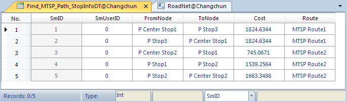

### Introduction

In real life, many stores need to deliver goods to the other shops. Example 1:
The fast-food restaurant needs to find the shortest route that delivers the
food to the customers. Example 2: The shuttles of the supermarket need to find
multiple routes that can deliver the shoppers to their communities, and the
total cost must be minimum. The MTSP of SuperMap Desktop .NET can help find
the optimal delivery route according to the specified origins and
destinations.

### Operating Instructions

1. Open the network dataset.
2. In the **Traffic Analysis** tab on the **Network Analysis** group, check the **Environment Settings** checkbox. The **Environment Settings** window appears. In this window, you can set the MTSP parameters (such as weight field and node/edge ID field), the analysis result parameters, and the tracking analysis parameters (you only need to set it for the tracking analysis). For more information, see [Environment Settings Window](NetAnalystEnvironmentWIN).
3. An instance for creating a new MTSP: Click **Traffic Analysis** > **Network Analysis** >Gallery> **Logistics and Distribution.** The **Instance Manager** window appears, and now the edit operation of MTSP is activated. For more information, see [Instance Manager Window](InstanceWIN).
4. Adding the points of origins. Two ways for adding: One is to click **Mouse Adding** on the toolbar of the **Instance Manager** window; the other one is to click **Import** on the right-click menu of **MTSP Center Stop**. For specific operations, please refer to [Add Stations](ImportLocations). The center point you added in the map window will be automatically showed in the **Center** list tree of the **Instance Manager** window.  Note: If you need to delete a point of origin, please select the point in the list tree and then click **Remove** in the right-click menu, or press **Delete** key.
5. The destination points and the barrier points can be added in the same way. For more information, see [Barrier Point Manager](BarrierManagement).
6. Click **Parameter Settings** on the toolbar of **Instance Manager**. The **Find MTSP PathSetings** window opens (as shown in the figure below). In this window, you can set **Solution Selection** and **Result Settings**. 
   * **Solution Selection** : **Overall Optimal Decision** controls every single cost of the delivery routes to make the cost for every route tend to be equal, but the total cost may not be minimum. If you select **Least Total Cost** , some origin points may be provided much more cost than the others, but the total cost is minimum.
   * **Save Node Information** : Select to determine whether to save all the nodes that the delivery routes pass. If you select **Save Node Info** , then you can save the nodes as point dataset and name it. And the dataset will be saved in the data source of the network dataset. The field NodeID denotes the identification of node; the field RouteID denotes the identification of route. 
   * **Save Edge Information** : Select to determine whether to save all the arcs that the delivery routes pass. If you select **Save Edge Info** , then you can save the arcs as line dataset and name it. And the dataset will be saved in the data source of the network dataset. The field EdgeID denotes the identification of route. 
   * **Stop Statistics Information** : Select to determine whether to save the statistics information of the stops. If you select the check box, then you save the statistics information of the stops as attribute table dataset and you can also name it. The dataset will be saved by the statistics information of the analysis stops, including the start stops, the end stops, the cost, etc.  As shown in the following figure, there is an attribute table of stop statistics. The table records the order of analysis results that pass through every stop and the cost. The FromNode and ToNode fields denote the start stop and the end stop. The cost field denotes the cost between adjacent sites. The ViaOrder field denotes this point located at a specific segment of the route. The Route_ID field denotes the route ID generated by the analysis.    
  * **Open the Path Guide** : Path guide records the path information in the results of network analysis. A path guide object contains a path line from the start to the end. Check "Set Path Guide" to output the analysis results in the Path Guide window. For more information, see [Path Guide](PathGuide).
  * Click **OK** to exit the dialog box.
7. Click **Execute** in the **Network Analysis** group to perform MTSP or click the in the **Instance Manager** window. The analysis results will be immediately displayed in the map window, and the results can be saved as a dataset for the future use.

### Note

* The origins and the destinations can be exported as point dataset for the future similar analysis. 
* The points of origins and the points of destinations can be put on the nodes and edges or within the vicinity of the snap tolerance.
* Click Mouse Moving, and then select and drag the point that you want to move.
* If you have set the barrier points in the network analysis layer, then the barrier points would be displayed in the **Barrier Point** list of the **Instance Manager** window in which you could manage them. For how to add a barrier point please visit [Barrier Point Manager](BarrierManagement).

### Related Topics

[MTSP Overview](9-1MulTSP)
