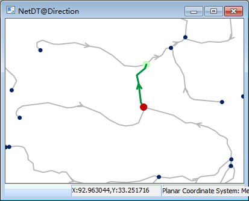

### Introduction

Search the nodes (edges) that are adjacent to the specified event point.

Adjacent analysis is a specialization of connectivity analysis. For the introduction of connectivity analysis, see [Connectivity Analysis](AccessibilityAnalyst).

### Basic Steps

1. Open a network layer.
2. You need to set the parameters of network analysis environment before performing the analysis. Click **Spatial Analysis** > **Facility Network Analysis** and check **Environment** to open the **Environment** window. In this window, you can set weight field, node/edge ID, traffic rules, turn table, etc. For more information, see [Environment Settings Window](NetAnalystEnvironmentWIN).
3. An instance for creating a new adjacency analysis: Click **Spatial Analysis** > **Facility Network Analysis** > **Network Analysis** > **Adjacent Element Analysis**. For the introduction of the instance manager window, see [Instance Manager Window](InstanceWIN).  Only one event node is enough. After adding an event point, the point will be added in the instance management automatically. Right click to finish the operation.
4. Click **Parameter Settings** on the toolbar of **Instance Management** to open the **Adjacent Feature Analysis Settings** window opens. 
  - **Result Type**
    * **Node** : Search the adjacent nodes of the event point.
    * **Edge** : Search the adjacent edges of the event point.
  - **Search Direction** : Forward, Backward, and Both
    * Forward**: Find the adjacent elements along the direction of the arc.
    * **Backward** : Find the adjacent elements along the direction opposite to the arc direction.
    * **Both** : Find the adjacent elements along both directions (forward and backward).
  * **Search Level** : The grade of the edge that will participate in the adjacency analysis (i.e. network depth). Beyond the value of the search class that you set, the lookup will stop. In the adjacency analysis, the defaulted value is "1" which cannot be changed, and it only searches the adjacent edges (nodes) of the event point.
5. Click **Run** in the **Facility Network Analysis** group or click the **Run** button in the **Instance Management** window to perform the analysis.
6. The analysis results will be immediately displayed in the map window, and the **Output Window** prompts "adjacency analysis is successful". As shown in the figure below, they are the lookup results of forward, backward and both directions at the same event point. The arrow denotes the direction of arc, the red point is the event point, and the green points (lines) are the adjacent nodes (edges).  

 

### Note

  * The event point can be exported as point dataset for the future similar analysis.
  * The event point can be put on the nodes and edges or within the vicinity of the snap tolerance.
  * Click **Move Station by Mouse** , select and drag the event point to modify its position.
