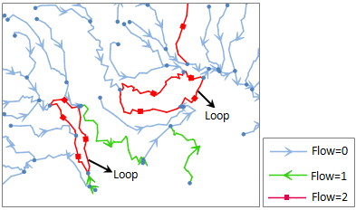

### Introduction

Check the loops in the network dataset.

In facility network, loops should be meet the following two conditions:

1. A closed path that made by at least two edges. 
2. The flow direction of edges should be 2, namely the uncertain flow direction.

The following figure is a part of facility analysis. Use different symbols to display flow direction of network edge.

  
  
### Baisc steps

1. Click **Check Loops** in the **Environment** window to open the **Check Loops**.
2. Check the **Save Analysis Results** check box to save the results as a line dataset, and then select a datasource and name it. Otherwise, the results will not be saved. The check box is checked by default.
3. Check the **Highlight Analysis Results** check box to highlight the analysis results in the current network dataset. The check box is checked by default.
4. Click **OK** to finish the operation. Click **Cancel** to exit.
