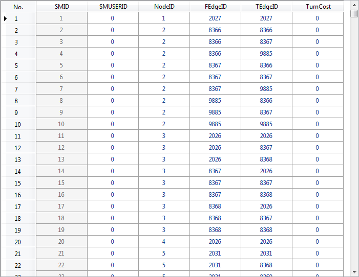

### Basic Steps

1. Click **Spatial Analysis** > **Facility Network Analysis** > **Environment** to open the **Environment** window. And then select the **Turn Table Settings** icon > **Create Turn Table** in the toolbar to open the **Create Turn Table** dialog box.

2. Set the source data. Select the source dataset and the datasource that are used to create a turn table.
   * **Datasource**: The dropdown menu lists all the datasources in the current workspace, and select the datasource containing the network dataset that is used to create the turn table.
   * **Dataset**: The dropdown menu lists all the datasets in the current workspace, and select the network dataset that is used to create the turn table.
   * **Node Filter**: Users set the filter conditions according to the needs. Only the turn information of nodes meets this condition, will it be added to the created turn table dataset.
3. Set the result data. Select the location and name to store the created result turn table dataset.
   * **Datasource**: The dropdown menu lists all the datasources in the current workspace, and select the datasource containing the result turn table dataset.
   * **Dataset**: The created result dataset name.
4. Click the OK button to create the turn table. Click the Cancel button to exit the current dialog box. 

After creating the turn table successfully, you create the result turn table dataset in the specified datasource, as shown below:

  

  * **Introduction for the turn table dataset**
      * SmID and SmUserID are system field and SmID is not allowed to be modified. The SmUserID is editable.
      * NodeID is a node identification field, and it records the ID of each node that satisfies the specified SQL expression(s);
      * FEdgeID and TEdgeID record the start and end IDs of the turn that passes this node.
      * TurnCost records the cost of turning from one arc to another arc. The default value is 0, representing no cost. Users can assign this value according to their needs.

### Related Topics

[Turn Table](TurnTable)

[Set Turn Table](SetTurnTable)
