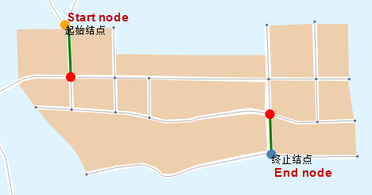

### Introduction

If the start node and end node are connected by multiple routes, nodes or edges that must be passed by all routes will be searched.

To make sure the connectivity of two points, points and lines that must be passed by can be queried by Critical Element Analysis. If queried points and lines are unobstructed, the two points are connected.

### Basic Steps

1. Open the network layer in the current map window.
2. You need to set the parameters of network analysis environment before performing the analysis. Click **Spatial Analysis** > **Facility Network Analysis** > **Environment** to open the **Environment** window. In this window, you can set weight field, node/edge ID, traffic rules, turn table, etc. For more information, see [Environment Settings Window](NetAnalystEnvironmentWIN).
3. An instance for creating a new critical element analysis: Click **Spatial Analysis** > **Facility Network Analysis** > **Network Analysis** > **Critical Element Analysis**. For the introduction of the instance manager window, see [Instance Manager Window](InstanceWIN).
4. You need to add a start point in the current layer. The application provides two ways to add a point: One is to click **Add by Mouse** on the toolbar of the Instance Management window; the other one is to click **Import** on the right-click menu of Event Point. For specific information, please refer to [Add Station](ImportLocations.htm).
5. You can add an end node following the way of adding a start node.
6. Click **Parameter Settings** icon on the toolbar of **Instance Management** to open the **Critical Element Analysis Settings** window. 
7. Set analysis result type in the **Critical Element Analysis Settings** dialog box.
  * **Critical Node** : Nodes that must be passed by from start node to end node.
  * **Critical Edge** : Edges that must be passed by from start node to end node.
8. Click OK to exit the dialog box.
9. Click **Run** in the **Facility Network Analysis** group or click the **Run** button in the **Instance Management** window to perform the analysis.
10. When the analysis is finished, the result will be added to the map for display automatically. And the Output Window will display related information also. The result is as shown below: red points indicate the critical nodes and green lines indicate critical edges.  

  
###  Related Topics

 [Adjacency Analysis](AdjoinAnalyst)

 [Connectivity Analysis](AccessibilityAnalyst)
