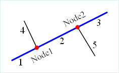
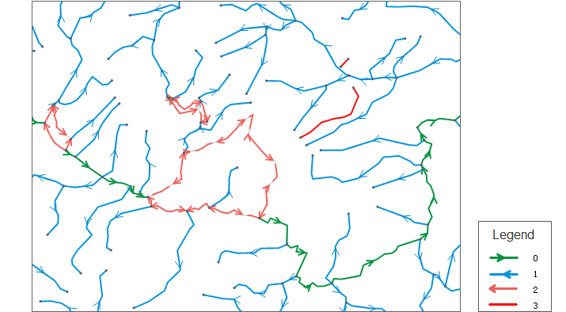

In our real world, the common facilities are municipal water network, transmission lines, gas pipelines, telecommunications networks, water system, etc. All the networks' resources are flowing directionally, which can be modeled and analyzed with the facility network.

The facility network analysis is one of the common functions of network analysis. It mainly processes a variety of connectivity analyses and tracing analyses.

The facility network analysis must follow some rules to build the network models. It must have the flow direction, which is the flow direction of the substance. The network direction depends on the network topology, and the locations of the source and sink.

### Basic Concepts

A facility network is composed of a group of edges and junctions. It can be used to express and model the real-world network facilities according to the specified connectivity rules. Users can specify the meaning and rules of the basic elements (points/lines) that compose the facility network to specify how the resources flow in the facility network.

  
  
The figure 1 is a simple network diagram. The thick blue line is the main pipeline composed of segments 1, 2, 3; the thin black segments 4 and 5 are the branch pipeline; the red junctions Node1 and Node 2 are the connected points of the main pipeline and branch pipeline.
* **Edges** : The established facility network generally includes the line objects, which are used to denote the flowing resource pipelines such as water pipelines, electric wires, natural gas pipelines, etc.
* **Simple Edges** : The edge that can only connect two junctions with its two endpoints, such as the branch pipelines 4 and 5 in the figure 1. The simple edges don't have the internal connectivity. If you need to add a new junction on it, then it must be split into two simple edges. 
* **Complex Edges** : Besides the two junctions at the end, the complex edge also can be added junctions in its middle. As shown in the figure 1, the blue main pipeline connects the two branch pipelines at the junctions Node1 and Node 2, but it is not really be split, i.e., you can add as many junctions as you can.   Note: Universal GIS Core (UGC) currently doesn't have the complex edges, i.e., all the complex edges will be split physically into simple edges.
* **Junctions** : The facility network generally includes the point objects, which denotes the junctions of two or more flowing resource pipeline, such as the pumping stations and valves of the water network, electric gates of the power grid, and supply points of the natural gas network.
* **Source** : The junctions that the resources flow out of, such as the power station and water station in the real world. 
* **Sink** : The junctions that the resources flow into, such as the access points of the power grid and water network in the real world.
* **Network Weight** : Every network can associate with a group of weights. For example, there is a hydraulic weight in the water network, which associates with the edge's length. It represents that the water pressure continues to reduce with the water flowing due to the friction of the pipeline. A type of network weight can associate with one or more than one types of objects. The weight value can be 0 like all the values of the orphaned junctions that do not associate with any fields are 0.
* **Valid Feature and Invalid Feature** : All the edges and junctions of the facility network can be invalid due to some reasons (for example, the closed valve results in a segment of water pipeline that is obstructed). Invalid edges/junctions turns into network barriers. Valid or invalid feature can be denoted by a field. 

The meanings of the numbers in the direction field are described in the following table:

Number | Description  
---|---  
0 | The direction of the edge is from the FromNode to the ToNode.  
1 | The direction of the edge is from the ToNode to the FromNode.  
2 | The edge is loop, i.e., invalid direction.  
3 | The edge is unconnected.  
  
The figure below shows a river network after its direction is built. Different colors and lines denote distinct directions. Refers to the above table about the meanings of the numbers in the legend.

  
