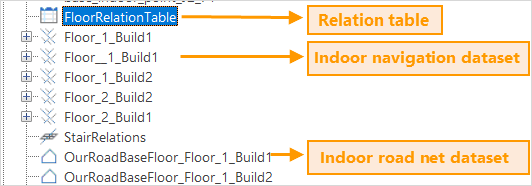
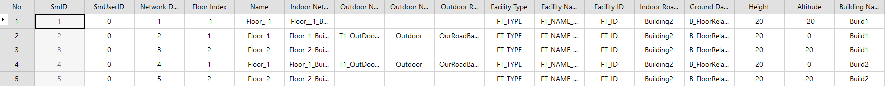

To achieve indoor navigation, we need to organize and store kinds of indoor
features and information effectively, thereby offering data and model supports for indoor navigation functions like indoor positioning, information query, path analyses, and so on.

SuperMap iDesktop provides visual tools to build indoor navigation models. It can organize information like indoor roads, stairs, entrances, and exits of one floor, several floors, or even several buildings resulting in network
datasets. It also supports adding outdoor road data to build an indoor-outdoor integrated navigation model.

###  Required Data

To build a navigation model successfully, you must prepare indoor network data and critical facility data (stairs, entrances, and exits). You may prepare some other POI data and outdoor road data according to your requirements.

  * **Indoor Network Data** : Road data, which is the basic data for navigation model building, is saved in a line dataset or a network dataset. Each floor corresponds with a group of road data.
  * **Critical Facility Points** : typical critical facility points include elevators, escalators, stairs, and entrances/exits. Elevators, escalators, and stairs are used for navigating among floors. The entrance/exit data plays an important role to connect different areas like two buildings. The data must have the following attributes.

Parameter | Description | Data Type  
---|---|---  
Facility ID  | Every facility has a unique ID. An elevator has a unique ID for each floor. | Wide Character  
Type | Set type values for facilities according to their attributes. For example, set the elevator to 25136, the stair to 25134, the escalator to 25135, and the entrance/exit to 25062. These values can be used for creating a unique value thematic map based on stair points in a navigation scene. | Wide Character  
Name | Names of elevators, stairs, and so on which can be used for creating a label thematic map in a navigation scene. | Wide Character  
Floor ID | The ID of each floor. | Wide Character  

  * **Other POI data** : to make the navigation map more abundant, you can add POI data. For example, you can add information like washroom points, ATMs, checkout counters to navigate in a mall. The POI data should have the following attributes:

Parameter | Description | Data Type  
---|---|---  
POI ID | Each POI has a unique ID. | Wide Character  
Name | POI Data Name | Wide Character  

  * **Outdoor Road Data** : Outdoor road information is saved in a network dataset. iDesktop can create a relationship between outdoor road data and indoor model data, based on the entrance /exit data, for indoor-outdoor integrated navigation.

###  Instructions

  1. Click **Traffic Analysis** > **Indoor Navigation** > **Build Indoor Network** to open the dialog box **Build Indoor Navigation**.
  2. **Floor List** : Click the **Add** icon button to add all involved floors that can be in the same building or in the different buildings. 
    * **Building Name** : Enter the building name. Build1 is by default.
    * **Floor Index** : Enter an ID for the current floor. 1 is by default for the first floor.
    * **Name** : Enter a name for the current floor. Floor_1 is by default for the first floor.
    * **Height** : The height of the current floor. The default value is 20 meters. iDesktop will take the value as the altitude to stretch the floor when building an indoor navigation model. 
  3. **Parameter Settings** : Specify all data you need including network data, critical facility point data, other POI data, and outdoor road data. iDesktop will generate a network dataset for each floor. Therefore, we need to set parameters for each floor separately. For more specific information on each parameter, please refer to Required Data. For example, to build network data for Floor_1 of Build1. We can follow the following steps: 

  * **Route Line** (required): Set the network dataset of the Floor_1 to base_indoor_link_J1_F1.
  * **Key Facility Points** (required): Set the key facility point dataset to NewDataset_J1_F1 and specify the ID, Name, and Type for the facility data.
  * **Other POI** (optional): to add some points of interest, you can specify a POI dataset and set the ID and Name for the POI data.
  * **Outdoor Road Data** : Specify the outdoor road dataset to connect indoor area and outdoor road. Here we set it to areaJ_poi_Network.

Repeat the steps 2 and 3 to add other floor data.

  4. **Result Settings** : Select a datasource to save the result and specify a name for the resulting dataset. FloorRelationTable is by default. The result is an attribute table which records the relationship between stairs, elevators, and escalators. Hence, when adding other floor data, the result dataset should be the same.
  5. **Perform the operation** : An indoor navigation model is composed of a relationship attribute table, indoor network datasets, floor datasets, and outdoor datasets. We got the following result after adding three floors of the building Build1.  
    

  * **Relationship attribute table**: records all involved data and floors' relationship which will play a significant role during navigating. 

The table records attribute information on all indoor network datasets, all
outdoor network datasets, and the height and altitude of each floor. The
altitude of each floor derives from the height you specified. For example, set the height to 20 in meters. The altitude of the first floor is 0 meter. For the third floor, its altitude is 40 meters.

The following table displays the attribute information of the three floors in
the building Build1.

  
 
  * **Indoor network dataset** : There is a one-to-one correspondence between a floor and the network dataset which saves its road-net data. Therefore, there are three network datasets produced after adding three floors in the navigation model. They are Floor_1_Build1, Floor_2_Build1, and Floor_3_Build1. 
  * **Indoor road net dataset** : The dataset has only one region object whose bounds are the union of the bounds of all road net data of floors involved in the navigation model building. It will be used for a 3D scene to display the ground of a building like Build1. In the example, B_FloorRelationTable is the indoor road net bottom dataset.
  * **Outdoor road net dataset** : the dataset is created based on the outdoor road data we specified. It could be used for a scene to display the ground connecting indoor space and outdoor space. Such as OurRoadBaseFloor_Floor_1_Build1 is an outdoor road net dataset.

###  Related Topics

  * [**An Overview of Indoor Navigation**](IndoorNavigation)
  * [**Create a Relationship between Facilities**](BuildStairRelation)
  * [**Indoor Navigation Analysis**](IndoorNavigationAnalysis)