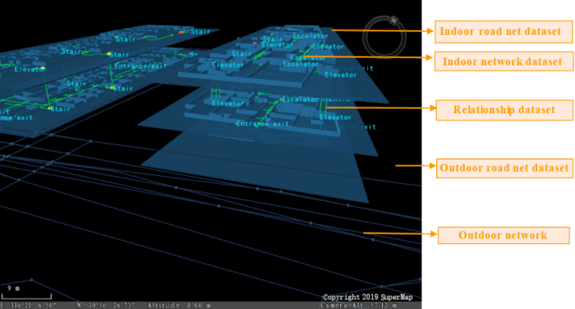
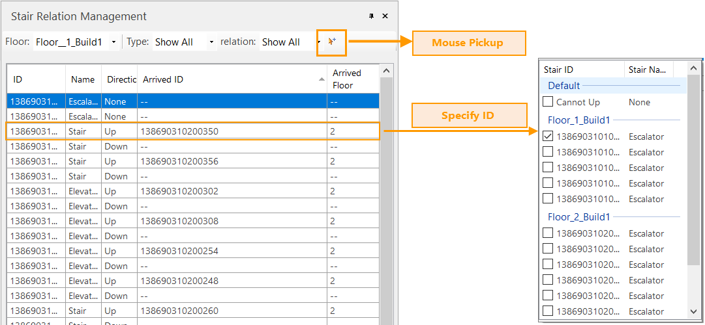
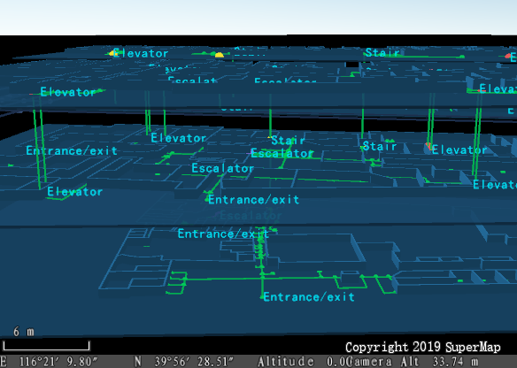

An indoor navigation model can organize data related to floors and buildings.
To navigate between different floors, we need to create a relationship table
to connect elevators, stairs, and escalators properly. SuperMap iDesktop
provides visual tools to create relationships between floors. Loading an
indoor navigation model into a scene, you can specify the running direction of
each escalator conveniently.

###  Load Indoor Navigation

Before creating a relationship table, you need to load your indoor navigation
model. iDesktop could add all indoor network datasets, floor datasets, indoor
road net datasets, outdoor road net datasets, and outdoor network datasets
together, resulting in a 3D navigation map automatically according to the
relationship table.

**Instructions** :

  1. Function Entrance: **Traffic Analysis** > **Indoor Navigation** > **Build Stair Relation**. The dialog box **Load Indoor Navigation Model** will appear where you can specify the following information.
    * **Route Line Settings** : specify the datasource, where your navigation model is saved, and a name for the resulting dataset.
    * **Stair Relation Dataset** : this dataset is a 3D line dataset for elevators, escalators, and stairs connections. You could add an existing dataset or create a new one.
  2. After all, iDesktop will load all datasets in your navigation model and generate a 2D and 3D integrated navigation scene automatically. In the meanwhile, the dialog box **Stair Relation Management** pops up. 
  

###  2D and 3D Integrated Navigation Scene

The scene is created by iDesktop automatically through different style
settings and thematic map processing. It can display the distribution of
floors and buildings intuitively. Therefore, you can view the critical
facilities of buildings by the scene conveniently.

The Layer Manager manages all floor data including indoor road net datasets,
indoor network datasets, the label thematic map created from each network
dataset, the unique thematic map created based on the type of each facility to
distinguish them easily. If you have added outdoor network data, iDesktop will
add both the outdoor network dataset and the outdoor road net dataset.

Note: it may take a bit long time to load an indoor navigation model which has
massive data. Please be patient.

###  Relationship Management

**Stair Relation Management** organizes some features to manage facilities.
You can check the type of each facility and specify the running direction of
each facility. For example, you can specify that an elevator will go up or
down.

  * **Floor** : This dropdown button lists all floors involved in your indoor navigation model. You can select any one of them to check and manage all facilities on that floor.
  * **Type** : This dropdown button lists all facility types including elevator, escalator, and stair. You can check an item like **Elevator** to check all elevators on the current floor.
  * **Relation** : The dropdown button list all relationships that each facility can have including Connected and Unconnected. You can check any of them to filter facilities showing on the table.

  
  
**Facility table** : the table will list information of facilities on the
currently specified floor including not only the ID, the type, and the
direction of each facility, but also the ID and the number of the next floor
where each facility will arrive. You can double click on a facility to
highlight it on the 3D scene.

The ID of each facility is fixed. As we know, each facility like an elevator
may go up or go down. Hence, we need to make two records to denote which
floors that each facility can go. For example, an elevator on the first floor
can go up to the second floor. Therefore, we should set Arrived Floor to 2 and
Arrived ID to the second floor ID in one record. Since the given building has
no floors underground, which means the elevator can not go down, we could set
both Arrived ID and Arrived Floor to -- in another record.

**Note** : If the coordinates (x, y) of two facilities from two adjacent
buildings are the same, iDesktop would create the relatioships between the two
facilities automatically when loading your the indoor navigation model.

**Create a relationship between facilities**

iDesktop provides two methods to create a relatioship between facilities
including **Mouse Pickup** and **specifying the floor ID**.

  * **Mouse Pickup** : Select the facility point you want from the facilty table and click on the icon button **Mouse Pickup**. Move your mouse onto the scene and select the facility point to arrive. And then iDesktop will connect the two points resulting in a 3D line and record related information.
  * **Specify Floor ID** : click on the item Arrived ID and select the ID of the floor to arrive. 

The following pictures show the contrast before and after creating relatioships among facilities.

  

###  Related Topics

  * [**An Overview of Indoor Navigation**](IndoorNavigation)
  * [**Build Indoor Navigation Model**](BuildIndoorNavigationModel)
  * [**Indoor Navigation Analysis**](IndoorNavigationAnalysis)
