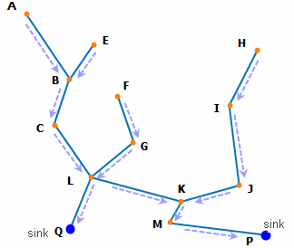
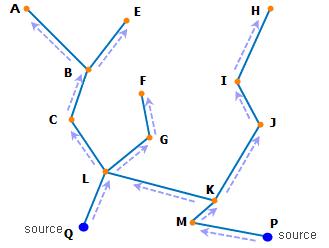

### Introduction

The multi-element tracing analysis supports 5 analysis types: Common Upstream, Common Downstream, Connected Edge, Unconnected Edge, Multi-connected Loops.

**Common Upstream**

Searches the common upstream nodes/edges of the specified nodes/edges.

As it is shown in the figure below, the water represents the flowing substance in the facility network. Q is a sink node. Then Q receives the water input, and the nodes A, B, C, L, E, F and G are all upstream nodes of Q, which are also called the upstream of Q since the water from those nodes flows into Q finally. The edges AB, BC, CL, LQ, EB, FG and GL are the upstream edges of Q, which are also called the upstream of Q.

  
  
As it is shown in the figure below, the flow direction is the arrow direction in the picture. If you want to search the common upstream edges of Q and P, the analysis result will be AB, BC, CL, EB, GL and FG.

  
  
**Common Downstream**

Searches the common downstream nodes/edges of the specified nodes/edges.

As it is shown in the figure below, the water represents the flowing substance in the facility network. Q is a source node. The water flows out from Q, and the nodes A, B, C, L, E, F and G are all downstream nodes of Q, which are also called the downstream of Q since the nodes receive the water from Q. The edges BA, CB, LC, QL, BE, GF and LG are the downstream edges of Q, which are also called the downstream of Q.

  

As it is shown in the figure below, the flow direction is the arrow direction in the picture. If you want to search the common downstream edges of QL and PM, the analysis result will be BA, CB, LC, BE, GF and LG.

  

  
**Connected Edges**

Finds other elements connected with the specified nodes/edges. The network dataset is generally connected, so there are usually more elements connected with the specified elements.

**Unconnected Edges**

Finds other elements connected with the specified nodes/edges. The network dataset is generally connected, if you want to determine whether all the network elements are connected, the **Unconnected Edges** can be used to check whether there are unconnected elements.

**Multi-connected Loops**

Finds the closed loop that connects all the specified elements. It can be divided into multi-node connected loops and multi-edge connected loops.
