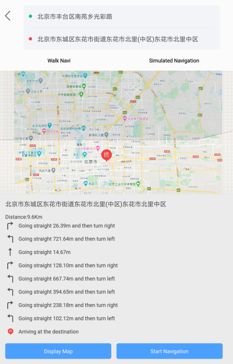

### Introduction

Compiles the basic road data according to network-related data, such as: basic
road line dataset, road name table, road lines and road name relationship
table, route node dataset, turn node dataset and administrative divisions,
then compiles the topology data and guide data, and finally packages these
data for the mobile side.

  * This function is based on the NavInfo data. The source data format is * .mif file, which must be imported into the datasource.

### Principle

The functions contains road name updating, basic road compiling, guide road compiling, and data packaging. The details are introduced here:

  * Road name updating: Updates the road names in the PathName field of the road name attributes table to the basic road line data according to the relationship between the RouteID and ID fields in the relationship table.
  * **Compile Base Road** : According to the basic road line data that has been updated with the road name, the road node data, the turn node data, the administrative division table, compiles and obtains the basic road data. The compiled basic road data will add the road level, the grid identification, the corresponding grid number, and other information.
  * **Compile Guide Data** : Compiles the road network guide data according to the compiled basic road data and specified map sheet ID.
  * Topology data compiling: According to the compiled basic road data, road network nodes, turn nodes, map sheet ID, compiles the topological relations of the nodes, the topological relations of the arcs, and packages the topological packages of 0, 1, 2, and 3 layers.
  * Data packaging: Packages the basic road data and topology 0, 1, 2 and 3 data, and the guide data.

### Function Entrances

  * **Traffic Analysis** > **Route Plan** > **Route Data Compilation** to open the dialog box **Compile Road Net Data**.

### Parameter Description

  * Click the **Add** icon in the tool bar to open the dialog box **Select** where you can specify the required line dataset.

**Note** : you are allowed to add several datasets.

  * In the **Compile Road Net Data** dialog box, you need to do the following settings: 
    * **Compile Type** : the application serves three types of compilation including **Compile Base Road** , **Compile Topology Data** , and **Compile Guide Data**.
    * **Road Net Node** : Set the road node data, which stores the topology relationship, node type, etc, to compile the guide data and topology data.
    * **Turn Node** : Set the turn node data, which stores the turn relationship, topology relationship to compile the guide data and topology data.
    * **Road Name** : Set the attributes table which stores the road names, update the values of the PathName field to the basic road line data according to the RouteID field.
    * **Road Name Relates** : Set the attributes table which stores the relationship between the basic road lines and road names, to relate the ID in the road line data with the RouteID in the road name attributes table.
    * **Administrative Region** : Set the administrative division attribute table dataset, which can be used to identify the administrative area on the left and right sides of the road data.
    * **Compile Bounds** : Set the map bounds to be compiled. Select all map or specify some map sheet ID. 
      * **All Map** : Compile the road data in full range.
      * **Specified Sheet ID** : If the compilation of some parts of the network data fails, the network data of the specified map ID can be compiled separately. In the drop-down option, select "specify the map ID", to select one or more map IDs, add it to the text box on the right side, then it will only compile the specified maps. 
      * **Specify Map Range** : Select the region dataset which the map sheet range is within. 
    * **Output Path** : Set the path of resulting data that saves the packaged road data.
      * Click OK to start. The result will be saved to the folder which is set previously, shown as below. The BK and Topo folders store some temporary data, which can be deleted; the Data folder stores the packaged basic road data, guide data and topology data.  
	
	  

    * The compiled data can be used in applications developed based on iMobile to implement path navigation. As the following picture shows, after specifying the starting point and the destination, performed the path planning and got the optimal path.
    
  
