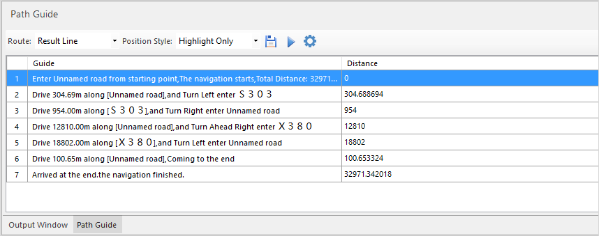
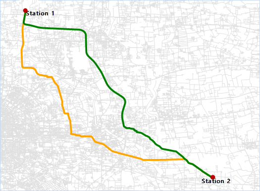

### Introduction

According to the constructed navigation model data, the network dataset can be navigated and analyzed to verify the correctness of the navigation model data.

### Function Entrances

  * Open the network datasource in the current window space. 
  * **Traffic Analysis** > **Navigation** > **Navigation**.

### Operating Instructions

1. Model file: Select the built navigation model file to provide the relevant analysis environment and road information for navigation.
2. Navigation Analysis Mode: Select the network dataset for the navigation model. 
    * Type Recommend: This model will give priority to highways and other high-level roads, and select the optimal route for navigation.
    * Min Distance: This mode indicates that the navigation result is the shortest route.
    * Do not take highway: Indicates that there are no high-speed sections of the navigation route.
3. Enable Path Guide: When this check box is checked, the guide results will show details of each route, including road name, distance, turn direction, and so on.      
4. Generate Alternative Route: If the selected navigation analysis mode is recommended mode or do not take high-speed mode, you can check the check box, and generate an alternative route program in the presence of other programs. There are two results of the results route and the alternative route in the analysis results. Note: There is only one result from min distance mode that can't generate alternative route.  To generate alternative routes successfully, data should meet the following three conditions.

    * The total cost of alternative routes must be less than 1.15 times of the cost of the shortest path. 
    * The sharing cost (the sharing paths of resulting routes and alternative routes) should be less than 0.75 times of the cost of the shortest path 
    * The difference between the cost of the alternative routes and the cost of the sharing route should be less than 1.1 times of the difference between the cost of the shortest path and the cost of the sharing cost.
5. After setting the navigation parameters, click the "OK" button, move the mouse to the current map, click the left mouse button in the right place to add the site. And you can also through the way of the "mouse to move" to adjust the location of the site, select the site to be adjusted, and hold down the left mouse button to move the site location.
6. The order of the sites in the instance manager window is the order in which the navigation passes, and the order of the stations can be adjusted in order by "Move Up", "Move Down" in the context menu.
7. After you have finished adding the site, click the Execute button in the "Instance Manager" window to perform the navigation analysis. The navigation results of the route will be displayed in the current map, and the output window will also indicate the total distance and time consumption information for navigation. The navigation results are shown in the following figure, where the green route is the navigation result and the yellow route is the alternate route.  
  
