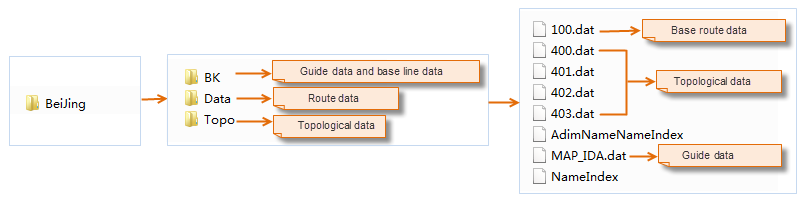
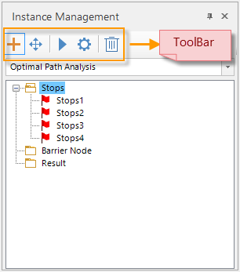
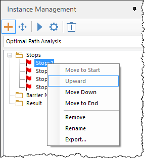
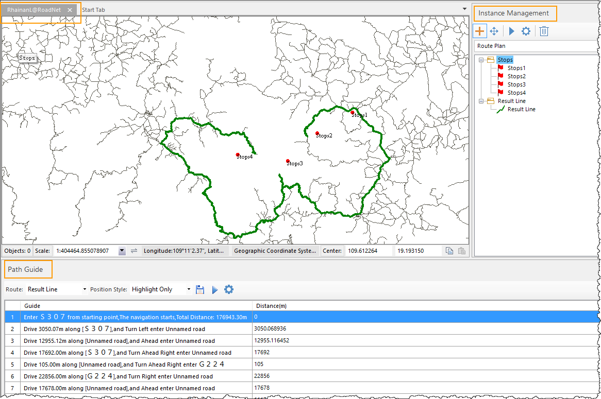

### Introduction

According to the compiled road network data results for road planning, and the
data for the road planning provides the relevant basic road data, topology
data and boot data. Compile and analyze the compilation data of road network.
Please refer to the page [Compile Road Net Data](CompileNavigationData.htm) on
data creation.

### Function Entrance

  * Open the corresponding road network dataset in the map window.
  * **Traffic Analysis** > **Path Plan** > **Route Plan**.

### Operating Instructions

1. Set the following parameters in the **Route Plan Settings** dialog box: 
    * **Road Model File** : Click the folder button on the right side of the text box to select the compiled road network data file which provides the relevant basic road data, topology data and boot data for the road planning.    
    * **Road Net mode** : The program provides three road planning modes, namely: 
      * **Type Recommend** : This model will give priority to highways and other high-level roads, select the optimal route for navigation.
      * **Min Distance** : This mode indicates that the navigation result is the shortest route.
      * **Do not take highway** : Indicates that there are no high-speed sections of the navigation route.
    * **Enable Path Guide** : When this check box is checked, the path planning results will show details of each route, including road name, distance, turn direction, and so on.
2. After setting the above parameters, click the "Apply" button, in the current map mouse pointer into a cross box, in the right place click the left mouse button to add the site. And the "Instance Manager" dialog box appears on the right side of the map window. Generate temporary data under the road network data source in the workspace manager, which contains two datasets, namely the path planning dataset (NavigationResult) and the site dataset (StopPoint). As shown below: 
 
3. Stops: Click the site through the right mouse button menu for site management, but also through the Instance Manager toolbar operation button to manage. 
    * The order of the sites in the instance manager window is the order in which the road planning passes, and the order of the stations can be adjusted in order by "Set as Start", "Move Up", "Move Down", "Set End" in the context menu.
    * You can adjust the location of the site by selecting "Move the mouse" in the instance manager toolbar, select the site to be adjusted, and hold down the left mouse button to move the site location.
    * You can use the right-click menu to "remove", "rename" and other operations.
    * Support for individual site export operations.    
4. After you add the site, click the Execute button in the "Instance Manager" window toolbar to perform the road planning. 
    * The road planning result route is displayed in the current map, and the path planning results are shown in the following figure, where the green route is the path planning result.
    * Path Guide: The road planning result displays detailed information about each route in the path guide window, including road name, distance, turn direction, and so on.
    * In the "Instance window", under the "Result route", a result route is generated. The result route supports exporting the result route dataset by the right mouse button.  
  
