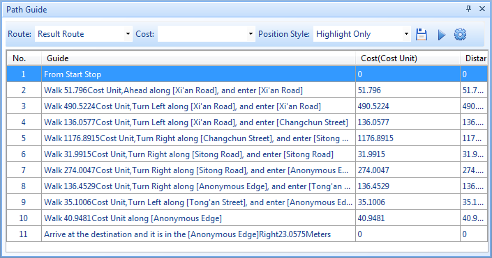

The path guide records the path information of the transportation analysis including Optimal Path Analysis, Find Closest Facility, TSP, MTSP, etc. A path guide object corresponds to a route from the start point to the end point.

### Introduction to Path Guide

Click **Traffic Analysis** > **Network Analysis** > **Path Guide** to open the **Path Guide** window opens.

Click **Parameter Settings** in the **Instance Management** window, and then check the "Enable Path Guide" checkbox. After the network analysis is executed, the **Path Guide** window will show the report of the path guide. 

  
  
**Introduction to the Toolbar of "Path Guide"**

**Route** : Selects the route in the current analysis results.
  * Generally the optimal path analysis just has one optimal path. When there are two or more optimal paths (e.g., the same cost path), you can choose one. 
  * Generally the traveling salesmen analysis just has one optimal path. When there are two or more optimal paths (e.g., the same cost path), you can choose one.
  * For finding the closest facility, the number of the path is determined by the **Facility Number** of the **Find Closest Facility Settings** dialog box. Generally the number of the paths is less than or equal to the value of **Facility Number**. If you select different paths, the list box will show the driving information of distinct paths. 
**Cost** : Selects the cost unit from the drop-down box. The application provides time units: seconds, minutes and hours; length units: miles, feet, inches, yards, degrees, millimeters, centimeters, decimeters, meters and kilometers. Note: The application supports customized units. You can directly input the unit in the text box, such as Min, Sec, etc. The cost unit in the guide text will automatically be updated as the new specified unit after being set successfully.
**Position Style** : The way that locates and browses the nodes/edges in the current map window. It includes: Highlight Only, Display Object in Center, and Full Screen. The default map scale is unchanged when the position style changes.
  * **Highlight Only** : Highlights the nodes/edges that you want to check in the current map window. The map scale is unchanged.
  * **Highlight Object in Center** : Highlights and centers the nodes/edges that you want to check in the current map window. The map scale is unchanged.
  * **Full Screen** : Highlights the nodes/edges that you want to check and displays then in a full screen. The map scale is unchanged.
**Save** : Click the button. The **Export Path Guide File** dialog box opens, and selects the Save Path, Save Type and Import File Name. Click **OK** to export the **Path **Guide** Report**. The format of the saved file is *.html.
**Play/Pause** : Click the **Play** icon to display the path from the start point to the end point; click the **Pause** icon to pause the playing. 
**Settings** : Click the icon to open the **Set Play Parameters** dialog box where you can set the parameters for the path animation.
  * **Total Cost** : The total cost value from the start point to the end point whose unit is cost unit.
  * **Total Time** : The total time from the start point to the end point.
  * **Speed** : Speed per frame, the default value is ** (cost unit/second)
  * **Play Symbol** : Click the button, and then the Marker Symbol Selector dialog box opens. You can set the animation symbol with it. 

**Introduction to Path Guide List Box**

* **Number** : The order that the application begins at the start point, passes all the inflection points, and finally arrives at the end point.
* **Guide** : The instruction to the path guide which begins at the start point and finally arrives at the end point.
* **Cost** : The cost between two inflection points whose unit is cost unit. It is related to Forward/Backward Weight Field
* **Distance** : The distance between two inflection points.
