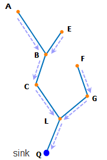
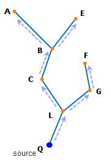

### Introduction

The shortest path tracing analysis supports 3 analysis types: Shortest Path Between Points, Trace the Shortest Path up, and Trace the Shortest Path down.

**Shortest Path Between Nodes/Edges**

Calculates the shortest route between the 2 added nodes/edges.

**Trace the shortest path up**

Searches the least cost upstream route according to the specified nodes/edges.

As it is shown, the water represents the flowing substance in the facility network. Q is a sink node. Q receives the water input, and the nodes A, B, C, L, E, F and G are all upstream nodes of Q, which are also called the upstream of Q since the water from those nodes flows into Q finally. The edges AB, BC, CL, LQ, EB, FG and GL are the upstream edges of Q, which are also called the upstream of Q.

In addition, with respect to the edge LQ, the nodes A, B, C, L, E, F and G are the upstream nodes of the edge LQ, which are also called the upstream of the edge LQ. The edges AB, BC, CL, EB, FG and GL are the upstream edges of LQ, which are also called the upstream of the edge LQ.

  
  
**Trace the shortest path down**

Searches the least cost downstream route according to the specified nodes/edges.

As it is shown, the water represents the flowing substance in the facility network. Q is a source node. The water flows out from Q, and the nodes A, B, C, L, E, F and G are all downstream nodes of Q, which are also called the downstream of Q since the nodes receive the water from Q. The edges BA, CB, LC, QL, BE, GF and LG are the downstream edges of Q, which are also called the downstream of Q.

In addition, with respect to the edge QL, the nodes A, B, C, L, E, F and G are the downstream nodes of the edge QL, which are also called the downstream of the edge QL. The edges BA, CB, LC, BE, GF and LG are the downstream edges of QL, which are also called the upstream of the edge QL.

  
