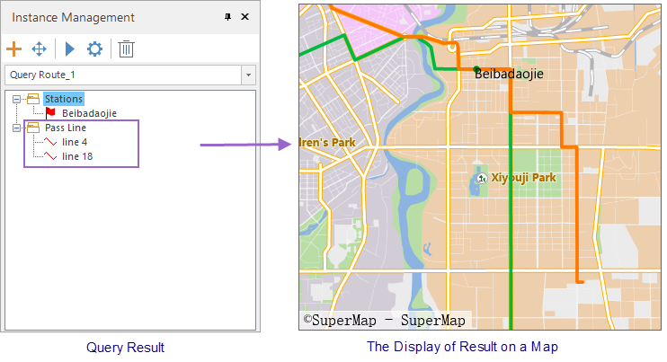

### Instructions

Query the route passing a specified station.

### Basic Steps

1. **Load traffic data** : Click "Traffic Analysis" tab > "Transfer Analysis" group > "Query Route" button to open the "Transfer Analysis Settings" dialog box, and then specify the requirement data for the traffic analysis including traffic stations, traffic lines, and relationship between stations and lines. 
2. Click "OK". The "Environment Settings" window and "Instance Management" window pop up, and a temporary datasource is produced under your datasource. 
3. **Environment Settings** : In the window, you can set series of parameters on walking, tolerance, entrance and exit information, meanwhile you can modify station, line, relationship data. For more specific description, please refer to [Traffic Analysis Environment Settings](TrafficEnvirSet).
4. **Temporary data** : A newly generated datasource "Temporary Data" is shown in the Workspace Manager with two datasets (Route_Plan__StopPoint and Route_Plan__NavigationResult) for saving two kinds of data in the Instance Management window.
5. In the Instance Management window, you can specify detail stations according to your needs. There are two ways to add stations.
    * **Add stations** : Left click your mouse on your map window in appropriate positions to add stations.
    * **Import stations** : Import your dataset as stations. In the "Instance Management" window, right click "Stations" and select "Import", for more details, please refer to [Import Stations](../ImportLocations).
6. The station will be added into the Station directory automatically in the Instance Management window.
7. Click **Traffic Analysis > Network Analysis > Execute** or click "Execute" button in the Instance Management window to query routes based on relative parameters.
8. The analysis result will be added into your current map. Routes will be shown in different colors. All of routes passing the station will be listed under the Result Line directory. Click a route, it will be highlighted in your map.  

  

### Related Topics

 [Obtain traffic data](TrafficDataPrepare)

 [Set the traffic analysis
environment](TrafficEnvirSet)

 [Load traffic data](LoadTranfficData)

 [Transfer analysis](TransferAnalysis)

 [Query station
analysis](FindStopsByLineStop)
