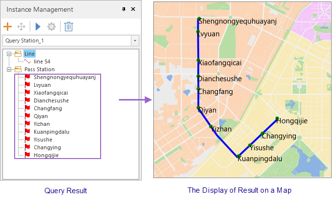

### Instructions

Query all stations in a specific route. You can obtain detail information on
these stations.

### Basic Steps

1. **Load traffic data** : Click "Traffic Analysis" tab > "Transfer Analysis" group > "Query Station" button to open the "Transfer Analysis Settings" dialog box, and then specify the requirement data for the traffic analysis including traffic stations, traffic lines, and relationship between stations and lines. 
2. Click "OK". The "Environment Settings" window and "Instance Management" window pop up, and a temporary datasource is produced under your datasource. 
3. **Environment Settings** : In the window, you can set series of parameters on walking, tolerance, entrance and exit information, meanwhile you can modify station, line, relationship data. For more specific description, please refer to [Traffic Analysis Environment Settings](TrafficEnvirSet).
4. **Temporary data** : A newly generated datasource "Temporary Data" are shown in the Workspace Manager consisting of two datasets (Query_Station_Line and Query_Station_Result) to save two kinds of data in the Instance Management window.
5. **Instance Management** : Specify a line based on your needs in the map window as the query line. You can click anywhere on a line to select it, then the line will be highlighted.
6. After that, the selected line will be added into the Instance Management window.
7. Click **Traffic Analysis > Network Analysis > Execute** or click "Execute" button in the Instance Management window to query stations based on relative parameters.
8. After completing the query operation, all stations will be show on your map. And in the Instance Management window, under the Pass Station node, all pass stations will be listed, and you can click any one of them to position and highlight it.  

  

###  Related Topics

 [Obtain traffic data](TrafficDataPrepare)

 [Set the traffic analysis environment](TrafficEnvirSet)

 [Load traffic data](LoadTranfficData)

 [Transfer analysis](TransferAnalysis)

 [Query route analysis](FindLinesByStop)
