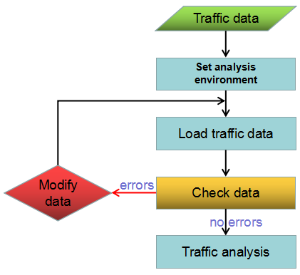

### Instructions

Public transport has become part of our life nowadays. No matter we go to
work, travel or return home, vehicles are necessary. Along with city
development and constructions of traffic facilities, public traffic network
are more and more complex and various. Hence, choosing a correct, humanized
transfer scheme is very important in our lives. The feature of traffic
analysis can help people to choose appropriate schemes.

The traffic analysis is an analysis module which aims for public transport
such as bus, subway, train and so on to analyze traffic transfer, query
stations and query routes. The traffic analysis function can provide an
optimal scheme for you through efficient, accurate and flexible search
algorithms.

* Abundant settings of stations and route information: fares, start time and interval, relationships between stations and lines, the relationships between stations and entrances.
* Flexible analysis parameter settings: station conflation, station capture, walking distance, transfer strategy, avoiding/alternative stations, routes.
* Accurately guiding routes: Through a network dataset, accurate walking routes can be given.

**Main procedure** : The procedure of traffic analysis of SuperMap can be roughly divided into 5 parts.

1. Obtain traffic data or import traffic data converted from data in other format.
2. Set up the traffic analysis environment including station environment, route environment, traffic relationship, and tolerances for station conflation and station capture, walking threshold and so on.
3. Load traffic data.
4. Check errors in traffic data through the feature of checking data, and then modify data until there are no errors.
5. Execute the traffic analysis including the trasfer analysis and the traffic query.

  

### Related Topics

 [Obtain traffic data](TrafficDataPrepare)

 [Set traffic analysis environment](TrafficEnvirSet)

 [Load traffic data](LoadTranfficData)

 [Trasfer analysis](TransferAnalysis)

 [Query route analysis](FindLinesByStop)

 [Query station analysis](FindStopsByLineStop)
