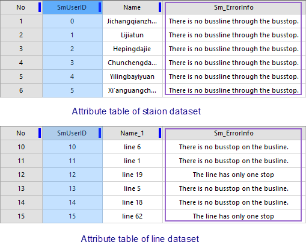

### Instructions

Traffic data is the core and basic of the traffic analysis. To make the
traffic analysis in SuperMap available, traffic data must contain these 5
kinds of data at least: traffic stations, routes, relationships between
stations and lines, relationships between stations and entrances/exits, and
network datasets. The first three kinds of data are required, another two
kinds of data are optional.

Before executing the traffic analysis, data used for the traffic analysis must be checked, then modify error data, afterwards set up the analysis environment and load data.

### Composition of traffic data

* **Station Dataset** : All stations acquired are saved into a station dataset. Every point in the dataset represents a station (a bus station or a train station). The two fields are required: Station ID (int 32 bits or int 64 bits) and Station Name. As follows, StopID is the station ID, Name is the Station Name.

SmUserID | Name | StopID | ...  
---|---|---|---  
1  | **Airport** | 1 | ...  
2 | **Xizhimen** | 2 | ...  
3 | **Dazhongsi** | 3 | ...  
... | ... | ... | ...  

* **Station Route Dataset** : All routes acquired are saved into a line dataset. Each line object represents a route with direction. Such as, for the bus No. 123, its departure station is A and its terminal is B. There are two line objects being saved into the same dataset, among them, one is the route from A to B, and another one is from B to A. 

A route dataset must contain two fields: route ID and route name. Also you can set up other fields, such as: Originating time, last train time, interval during buses, fares etc..

SmUserID | Name | LineID | ...  
---|---|---|---  
1  | **bus 11** | 1 | ...  
2 | **bus 8** | 2 | ...  
3 | **light rail** | 29 | ...  
... | ... | ... | ...  

* **Stations and route relationship dataset** : It is a tabular dataset used for confirming relationships between station and routes. In reality, a bus does not stop at some stations even though passing them. Hence, an accurate relationship table for stations and routes are necessary to avoid wrong analysis results and unnecessary loss. 

Every record of the dataset corresponds to a relationship between a station
and a route. Two fields are required: Route ID and Station ID. Also you can
set up a serial number of a station in a route.

SmUserID | LineID | StopID | ...  
---|---|---|---  
1  | **18** | 1 | ...  
2 | 27 | 8 | ...  
3 | 15 | 13 | ...  
... | ... | ... | ...  
  
**A dataset about relationships between stations and entrances/exits
(Optional)** : In some train stations, there are several entrances/exits, if
you want to query more detail information on stations, you can prepare a
dataset about relationships between stations and entrances/exits.

These kinds of data belong to 2D line dataset using for identifying
relationships and routes between stations and entrances/exits acquired by
measurement and digitalization. Every line object represents a route from a
station (entrance) to an entrance (station). Two fields are required in
dataset: Station ID and entrance/exit ID, also you can set entrance names and
so on.

**Note** : These kinds of datasets are not necessary. If you do not have it, transfer schemes between stations will take the straight lines or grid base map data.

* **Network dataset (optional)** :A network dataset consists of network segments and node objects and saves spatial topological relationships between them. It can serve as reference data for traffic analysis. With a network dataset, analysis results can be more accurate and humanized. When performing the transfer analysis, from a position to another position or a station, the system will calculate a realistic walking route. In contrast, the route will only be a straight line connecting the two positions.
* **Supported data formats** : Any types of data which can be imported into  as a point, line, region or tabular dataset through the function "Data Import" are supported for the traffic analysis function including *.mif, *.tab, *.shape and so on.

### Data Check

* Before executing the traffic analysis,  will check whether there are errors in your data.
* After finalizing the check operation, a field named "Sm_ErrorInfo" recording error information will be respectively added into the attribute table of every dataset involved in the traffic analysis. Below details contents of the field and descriptions.  

<table>
<thead>
<tr width="60%">
		<th width="15%">
Checked dataset
</th>
		<th width="20%">Error information</th>
		<th width="40%">Description</th>
	</tr>
	</thead>
	<tr>
		<th rowspan="2">Station dataset</th>
		<td>No route passes the station</td>
		<td>No any records related with the station in the Station-Route relation dataset.</td>
	</tr>
	<tr>
		<td>Repeat ID</td>
		<td>Sort the Station ID, if a value appears more than one time, other values are illegal values except the first one.</td>
	</tr>
		<tr>
		<th rowspan="3">Route Dataset</th>
		<td>A route has no any stations</td>
		<td>No any records related with the route in the Station-Route relation dataset.</td>
	</tr>
	<tr>
		<td>A route has one station</td>
		<td> </td>
	</tr>
	<tr>
		<td>Repeat ID</td>
		<td>Sort the Station ID, if a value appears more than one time, other values are illegal values except the first one.</td>
	</tr>
		<tr>
		<th rowspan="3">Station-route relationships dataset</th>
		<td>A station does not exist in the dataset</td>
		<td>The station dataset does not have the station</td>
	</tr>
	<tr>
		<td>A route does not exist in the dataset</td>
		<td>The route dataset does not have the route</td>
	</tr>
	<tr>
		<td>Not within the range of tolerance</td>
		<td>The relationship between a station and a route has been recorded in the dataset, but the distance between them is greater than the tolerance, then the staiton can not be captured to the route.</td>
	</tr>	
			<tr>
		<th rowspan="2">Station-entrances/exits relationships dataset</th>
		<td>A station does not exist in the dataset</td>
		<td>The station dataset does not have the station</td>
	</tr>
	<tr>
		<td>The spatil position does not match</td>
		<td>The two endpoints connecting a station and an entrance/exit must match the positions of corresponding stations in the station dataset, otherwise data will be considered wrong.
			Note: Every entrance/exit in traffic is saved into a station dataset as a station.</td>
	</tr>
</table>
  
**Note**: You must set up the analysis environment first to perform the traffic analysis.

  

### Modify traffic data

If there are some errors existing in your data, or there are some changes in
the real traffic network, you should modify your traffic data. To successfully
perform the traffic analysis, you must check your data then modify it until
there are not any errors.

###  Related Topics

 [Set traffic analysis environment](TrafficEnvirSet)

 [Load traffic data](LoadTranfficData)

 [Transfer analysis](TransferAnalysis)

 [Query routes](FindLinesByStop)

 [Query stations](FindStopsByLineStop)
