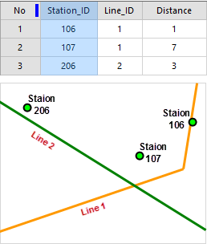

### Instructions

The Environment Settings window is used to set up some parameters for a
traffic analysis. The show and hide of the window are controlled by the
"Environment Settings" check box in the "Network Analysis" group.

The settings of analysis environment is the premise of data check and data
analysis.

### Traffic line settings

Set up relative information on traffic route data including the dataset that
routes belong to, line ID field, line name ID field and fields about auxiliary
information. The parameters with * are required.

**No.** | **Field** | **Description** | **Type**  
---|---|---|---  
1  | **Line Name Fields** | Set up a field on line names. If the field does not exist in the line dataset, the system will throw an exception. | Required  
2 | **Line ID Field** | Set up traffic line ID field. The type of the field must be int 32 bits or int 64 bits. If the field does not exist in the line dataset or its type is not matched, the system will throw an exception. |Required  
3  | **Line Alias Field** | Set up a line alias field | Optional  
4  | **Line Type Field** | Set up a field identifying types of traffic lines. It must be integer. 0, 1, 2 represent respectively bus, subway, trolley bus. | Optional  
5  | **Speed Field** | Set up a field about driving speed. | Optional  
6  | **Line Length Field** | Set up a field about line length. | Optional  
7  | **First Time Field** | Set up a field about departure time of the first bus. | Optional  
8  | **Last Departure Time** | Set up a field about departure time of the last bus. | Optional  
9  | **Interval Field** | Set up a field about departure interval between two buses. | Optional  
  
### Station Settings

Set up information about traffic stations including the dataset that stations
belong to, station ID field, station name field and station alias field. In
the settings of analysis environment, you must specify a StopSetting object
with correct settings of parameters to make sure the correctness of check and
load of data.

**No.** | **Field** | **Description** | **Type**  
---|---|---|---  
1  | **Station Dataset** | Set up a station dataset. It must be a point dataset. | Required  
2 | **Station Name Field** | Set up a field on station names. If the dataset does not have the field, the system will throw an exception. | Required  
3  | **Station Alias Field** | Set up a field on station alias. | Optional  
4  | **Station ID Field** | Set up a field about station ID. The type of the field must be int 32 bits or 64 bits. If the dataset does not have the field or its type is not matched, the system will throw an exception. | Required  
  
### Relation Settings

Set up information on the relationships between stations and routes, stations
and entrances/exits, and network dataset. Correct relations between stations
and lines, accurate station ID and line ID are necessary in the dataset.

**No.** | **Field** | **Description** | **Type**  
---|---|---|---  
1  | **Relation Datasource** | Set up a datasource saving the relation dataset. | Required  
2 | **Relation Dataset** | Set up a dataset about the relation between stations and lines. It must be a tabular dataset. | Required  
3  | **Line ID Field** | Set up a line ID field. The type of the field must be int 32 bits or 64 bits. If the dataset does not have the field or its type is not matched, the system will throw an exception. | Required  
4  | **Station ID Field** | Set up a station ID field. The type of the field must be int 32 bits or 64 bits. If the dataset does not have the field or its type is not matched, the system will throw an exception. | Required  
5  | **Stationn Order Field** | Set up a field about the order of a station in a route. | Optional  
  
### Exit Settings

Set up the relation parameters about stations and entrances/exits.

**No.** | **Field** | **Description** | **Type**  
---|---|---|---  
1  | **Exit Dataset** | Set up a dataset recording relationships between stations and entrances/exits. The dataset must be a line dataset. | Optional  
2 | **Exit Name Field** | Get or set a field about names of entrances/exits. | Optional  
3  | **Exit ID Field** | Get or set a field about ID of entrances/exits. Its type must be int 32 bits or int 64 bits. | Optional  
4  | **Entrance ID Field** | Get or set an entrance ID field of station-entrance relationship dataset. The type of the field should be int 32 or 64. If there is not the field or the filed type isn't integer, the application will throw exceptions.  | Required  
5  | **Station ID Field** | Get or set a field about ID of stations. Its type must be int 32 bits or int 64 bits. | Optional  
  
### Walking Settings

**No.** | **Field** | **Description** | **Type**  
---|---|---|---  
1  | **Walk Dataset** | Set up a walk dataset. It is a network dataset. According to segments and nodes to obtain reality walking route. | Optional  
2 | **Start ID Field** | Set up a field about starting node ID of segments in the network dataset. | Optional  
3  | **End ID Field** | Set up a field about end node ID of segments in the network dataset. | Optional  
4  | **Node ID Field** | Set up a field about node ID in the network dataset. | Optional  
5  | **Edge ID** | Set up a field about segment ID in the network dataset. | Optional  
  
### Tolerance Settings

  * **Station Snap Tolerance** : Determine whether a station is located in a route. Before confirming relationships between stations and routes, the system first determines the corresponding relation according to stations and a relation dataset, then excludes the stations from which the distances to corresponding routes are less than the tolerance. 

As follows: the tolerance is 5 meters, the distance from station 107 to the
route 1 is greater than the tolerance, hence it is considered out of the route
1, while the station 107 should be in the route 1 which can be known from the
relationships dataset. The reason may be that there are some errors in your
data or your relationships dataset.

  
* **Max Walking Distance** : Set up a value representing the maximum walking distance from a station to another distance when transfering. The scheme will be abandoned if the walking distance in it is greater than the value.
* **Unit** : Set up units of the tolerace and the walking distance.

###  Related Topics

 [Obtain traffic data](TrafficDataPrepare)

 [Load traffic data](LoadTranfficData)

 [Transfer analysis](TransferAnalysis)

 [Query route analysis](FindLinesByStop)

 [Query station analysis](FindStopsByLineStop)
