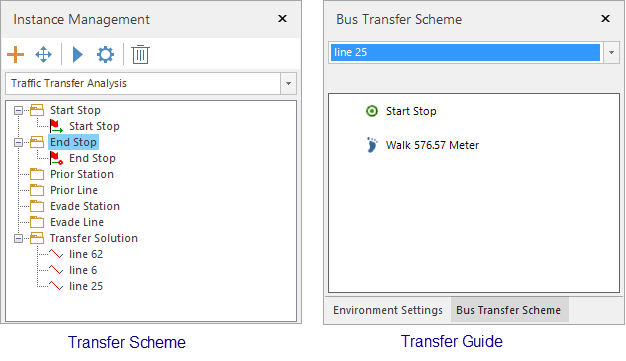

### Instructions

Main features includes: Transfer analysis and traffic query (querying stations
and lines). Transfer analysis is a procedure of analyzing schemes meeting your
requirements according to a given starting station and a given destination.

### Basic Steps

1. **Load traffic data** : Click **Traffic Analysis** > **Transfer Analysis** > **Traffic Tranfer** button. In the popup dialog box **Transfer Analysis Settings** specify all required data including traffic stations, traffic lines, and relationships between stations and lines. 
2. Click **OK**. The two windows **Environment** and **Instance Management** appears. In the meanwhile, a temporary datasource is produced. 
3. **Environment Settings** : In the window, you can set series of parameters on walking, tolerance, entrance, and exit information. Besides, you could modify station, line, relationship data. For more specific description, please refer to [Traffic Analysis Environment Settings](TrafficEnvirSet).
4. **Temporary Datasource** : There are 7 datasets in the datasource to save data specified in the window Instance Management including Traffic_Transfer_Analysis_Begin_Begion, Traffic_Transfer_Analysis_End, Traffic_Transfer_Analysis_PriorStop, Traffic_Transfer_Analysis_PriorLine, Traffic_Transfer_Analysis_EvadeStop, Traffic_Transfer_Analysis_EvadeLine, and Traffic_Transfer_Analysis_Result.
5. **Instance Management** : In the Instance Management window, you can set a series of data according to your requirements. Among them, the Start Stop and End Top must be specified, other data is not necessary.
    * **Start Point** : Left click your mouse in an appropriate position to add a starting point.
    * **Import a starting point** : to import a point dataset in the current workspace as a start stop, please right click the **Start Stop** node and select "Import..." For detail operations, please refer to [Import stations](../ImportLocations) dialog box.

    * **End Stop** : The way of adding a destination is the same with how to adding a starting point.
    * **Prior Station** : Specify one or more stations that the transfer routes pass preferentially. You can add prior station through left clicking your mouse or importing them.
    * **Prior Line** : Specify one or more routes that be chosen preferentially. You can capture a point in a route you want to select then left click your mouse to select it.
    * **Evade Station** : Specify one or more stations that you do not want to pass. The way of adding stations is the same with the way of adding a starting point.
    * **Evade Line** : Specify one or more lines that you want to evade. When creating the transfer scheme, the system won't consider these lines. The adding way is the same with adding a prior line. <br\>**Note** : You are allowed to add one starting point and one end point only. The two points are required, and other data is not necessary.

6. Click "Parameter Settings" button to open the "Transfer Analysis Settings" dialog box where you can set various parameters such as the departure time, the vehicle you want to take, the transfer tactic and so on.
    * **Depature Time** : Specify a departure time. The application will filter buses which will stop moving in half an hour before or after the time.
    * **Transfer Preference** : Set up the vehicles you prefer taking. The supported vehicles include subways and buses. You can select None (no preferred vehicles), Bus, Subway, or No Subway(excluding subways). The Transfer Preference can be used together with the transfer Tactic, Prior, and evaded lines/points to meet your needs well. The validity of Transfer Preference depends on that your data includes the types of routes and the relative attribute value is consistent with requirements.
    * **Transfer Tactic** : Four tactics are provided: Less Transfer, Min Distance, Less Walk, Less Time to meet different needs. 
A lot of elements are involved in the selection of transfer schemes, such as the tolerance, the walking distance in the Environment Settings, and the Transfer Preference, Transfer Tactic, and Walking Ratio in the Transfer Analysis Settings dialog box. Hence, no matter what tactic you select, calculating weight value combining other parameters is necessary to get an optimal scheme.
      * **Less Transfer** : Select the scheme with a minimum transfer time. If the transfer times of two schemes are the same, select the one with a less weight distance.
      * **Less Walk** : Select the scheme with the minimum walking distance and the minimum weight distance.
      * **Min Distance** : Select the scheme with the minimum weight distance.
      * **Less Time** : Select the scheme with the minimum cost.
    * **Walking Ratio** : Appraise all kinds of transfer schemes. Following contents details the work of a walking ratio. Suppose there are two transfer schemes. 

Scheme 1 (S1): 10 km by car and 1 km on foot

Scheme 2 (S2): 15 km by car and 0.5 km on foot

a. Walking Ratio: 15  
The overall consumption of S1: 10 + 1*15 = 25 
The overall consumption of S2: 15 + 0.5*15 = 22.5 
**_S2_** is better.

b. Walking Ratio: 2  
The overall consumption of S1: 10 + 1*2 = 12  
The overall consumption of S2: 15 + 0.5*2 = 17 
**_S1_** is better.
  
  * **Max Transfer Solutions** : The real transfer times should be less than the value or equal it.
  * **Show Traffic Line Navigation** : Check the box, after performing the traffic analysis, the "Bus Transfer Scheme" will appear where detail information on transfer routes is supplied.
7. Click **Traffic Analysis** > **Network Analysis** > **Execute**. Or click the execute icon button in the **Instance Management** window to perform the traffic analysis.
8. The analysis result will be added into the current window automatically. All lines you should take will be shown under the "Transfer Solution" node in the "Instance Management" window. Detail information on transfer routes will be shown in the "Bus Transfer Scheme" window.    

###  Related Topics

 [Obtain traffic data](TrafficDataPrepare)

 [Set traffic analysis environment](TrafficEnvirSet) 

 [Load traffic data](LoadTranfficData)

 [Query route analysis](FindLinesByStop)

 [Query station analysis](FindStopsByLineStop)
