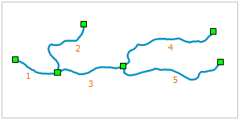

Auto Connect Line can snap a line segment object (A) to another line segment object (B) and form one line object according to the drawing order. When vectorizing line objects, this functionality will connect the line object at the nodes to form a new line object, this will improve the speed of the vectorization. The line objects to connect can be different types of objects, such as polyline, arc or rectangle.

The following figure shows a river, the auto connect line functionality can snap the line objects at the endpoints with the figure order when drawing and form a new object.

  
  
### Introduction

  * Auto Connect Line can be used for line layers and CAD layers.
  * The Auto Connect Line check box is available only when there are editable line layers in the current map window.
  * Auto Connect Line supports both sample objects and compound objects.

### Basic Steps

  1. Set the layer in the map window which is needed to enable the Auto Connect Line functionality as editable.
  2. In the Object Operations tab and on the Drawing group, click the dropdown button Drawing Settings, and then select "Auto-Connect Line" to enable the function. You can also press the prompt keys of "Shift+J" to activate the function.
  3. When the icon turns , it means the Auto Connect Line function enabled; If you want to cancel this function, click this function again.
  4. Draw a line object at any location in the map window, it can be line object of any type, such as polyline.
  5. Enable the snap functionality, snap to the location where the next line segment starts. The line object can be of any type, such a multi polyline. For the explain of the snap functionality, see [Enabling the Snappable Property](../Snapping/DTv2_Snappable.htm).
  6. Right click to finish the drawing. The new line object will be connected with the first line object to form a new object. The attribute of the new object will be the same with the first object.
  7. Repeat step 4 and 5 if it is needed to connect more line objects.

### Note

  * The Auto Connect Line functionality supports any line objects, such as polyline, freehand line and ellipse.
  * Only connect the endpoint of line segment, if the start location of the source line object is not a end point, the source object will not be connected to the current object.

