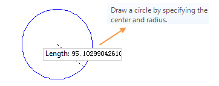
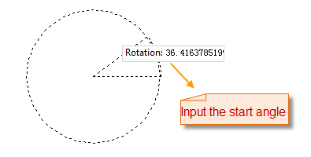
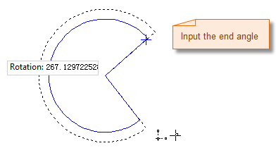
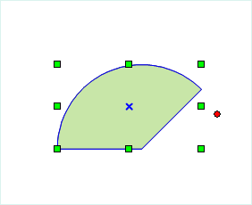

### Introduction

  * Sector command is used to draw a sector object. The application provides two methods to draw sectors, get circular sector by drawing circle, and get elliptical sector by drawing ellipse.
  * The sector object is a part of the ellipse object, so it is needed to draw an ellipse object before drawing a sector object.

### Basic Steps

**Circular sector**

  1. In the Object Operation tab, click the Region dropdown list in the Drawing group, select Circular Sector, the Circular Sector cursor appears.
  2. Move the cursor to the map window, input the coordinate value of the center in the paramter input box (you can swap between the two parameter input boxes with the Tab key), press Enter to input the location of the center.
  3. Move the cursor again and input the radius (length) in the parameter input box, press Enter key to finish the drawing.
  4. Move the cursor, input the start angle into the input box, press Enter.
  5. Move the cursor, input the angle swept by the sector, press Enter.
  6. Right click to cancel the current drawing operation.

  

**Elliptical sector**

  1. In the Object Operation tab, click the Sector dropdown list in the Draw group, select Circular Sector, the Sector cursor appears.
  2. Move the cursor to the map window, the coordinate value of the current cursor location will be displayed in the parameter input box when moving the cursor. Input the coordinate of the start point of the ellipse (you can switch between the two parameter input boxes by pressing the Tab key), the press Enter key to confirm the location of the ellipse.
  3. Move the mouse,the length of the line connecting the location of the cursor and the starting point of the semiaxis and the angle between it and the positive X axis will be displayed in the map window in real time (you can switch between the two parameter input boxes by pressing the Tab key), input the length and angle, press Enter to finish the drawing of a semiaxis of the oblique ellipse.
  4. Move the mouse, input the length of another semiaxis, press Enter. 
  5. Move the cursor, input the start angle into the input box, press Enter.
  6. Move the cursor, input the angle swept by the sector, press Enter.
  7. Right click to cancel the current drawing operation.

### Note

The pies in the line dataset are all common line objects. It only records the coordinates of nodes on line. But the pie objects drawed in the CAD dataset are the parameterized objects. It will record the corresponding parameters, such as the major axis, minor axis, center, start angle and scanning angle, etc.

