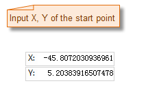
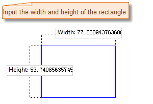
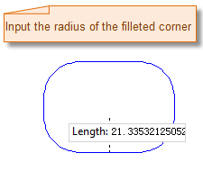
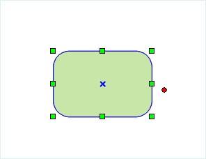

### Introduction

Rectangle, round rectangle, parallelogram and rhombus are all common quadrilaterals, the document below introduces the drawing of these quadrilaterals.

### Basic Steps

### Draws a rectangle

    * **Draw right angle rectangle by inputing coordinate values.**
      1. In the Object Operations tab, click the Region button in the Draw group. Select the Right-angle Rectangle and the cursor appears. Note that rectangle represent right angle rectangle when there is no emphasis.
      2. Move the cursor to the map window, you can see that the parameter box will display the coordinate value of the current location when the cursor moves in the map window. Input the coordinate value of a point on the right angle rectangle in the setting box (you can swap between the two parameter input boxes with the Tab key), press ENTER key to input the start location of the rectangle.
      3. Move the cursor and input the coordinate value of the other point on the diagonal of the rectangle, press Enter.
      4. Right click to cancel the current drawing operation.
    * **Draw rectangle with width and length**
      1. In the Object Operations tab, click the Region dropdown list in the Draw group. Select Parallelogram(Width, Height) and the cursor appears.
      2. Move the cursor to the map window, you can see that the parameter box will display the coordinate value of the current location when the cursor moves in the map window. Input the coordinate value of a point on the rectangle in the setting box (you can swap the focus with the Tab key), press ENTER key to input the start location of the rectangle.
      3. Move the mouse, the width and height of the rectangle will be displayed in the map window, input the width and height, press Enter. 

Note: If you press and hold the Shift key, you will get a square, that is the width and the height of the rectangle will be the same.

      4. Right click to cancel the current drawing operation.

### Draws a round rectangle

    1. In the Object Operations tab, click the Region dropdown list in the Draw group. Select Round Rectangle, and the Round Rectangle cursor appears. 
    2. Move the cursor to the map window,the parameter box will display the coordinate value of the current location when the cursor moves. Input the coordinate value of a vertex the round rectangle in the setting box (you can swap between the two parameter input boxes with the Tab key), press ENTER key to input the start location of the round rectangle.
    3. Move the mouse, the width and height of the rectangle will be displayed in the map window, input the width and height, press Enter. 

Note: If you press and hold the Shift key, you will get a square, that is the width and the height of the rectangle will be the same.

    4. Move the cursor, the radian of the round rectangle will change, input the radius of the round angle (length), press Enter.
    5. Right click to cancel the current drawing operation.

The process of drawing the round rectangle:

 |  |  |  
---|---|---|---  
Input the start point of the round rectangle. | Input the width and height of the round rectangle. | Input the radius of the round angle. | The result  
  
### Draws a parallelogram

    * **Draw parallelogram by inputing coordinate values.**
      1. In the Object Operations tab, Click the Region button in the Draw group, Select the parallelogram and the cursor appears.
      2. Move the cursor to the map window, you can see that the parameter input box will display the coordinate value of the current cursor when the cursor moves. Input the coordinate value of a vertex on the parallelogram in the input box (you can swap between the two parameter input boxes with the Tab key), press ENTER key to locate the parallelogram. 
      3. Move the cursor, input the coordinate value of the second control point in the parameter input box (you can swap between the two parameter input boxes with the Tab key), press Enter key to input the length and direction of one side of the parallelogram.
      4. Input the coordinate value of the next control point, press Enter to locate the third control point of the parallelogram.
      5. Right click to cancel the current drawing operation.
    * **Draw parallelogram by inputing length and angle.**
      1. In the Object Operations tab, click the Region dropdown button in the Draw group. Select Parallelogram(Length, Angle) and the parallelogram cursor appears.
      2. Move the cursor to the map window, you can see that the parameter input box will display the coordinate value of the current cursor when the cursor moves. Input the coordinate value of a vertex on the parallelogram in the input box (you can swap between the two parameter input boxes with the Tab key), press ENTER key to locate the start point of the parallelogram.
      3. Move the mouse, the length of the line connecting the location of the cursor and the start point and the angle between it and the positive X axis will be displayed in the map window in real time when the cursor moves, input the parameter value in the corresponding text box, (you can switch between the two parameter input boxes by pressing the Tab key), press Enter to input the length and angle of one edge of the parallelogram.
      4. Input the length and angle of another edge of the parallelogram with the same method, press Enter to finish the drawing.
      5. Right click to cancel the current drawing operation.

### Draw Diamond

    1. In the Object Operations tab, click the Region dropdown list in the Draw group. Select Diamond, and the diamond cursor appears.
    2. Move the cursor to the map window, you can see that the parameter input box will display the coordinate value of the current cursor when the cursor moves. Input the coordinate value of a vertex on the diamond in the input box (you can swap between the two parameter input boxes with the Tab key), press ENTER key to locate the start point of the diamond.
    3. Move the mouse, the length of the line connecting the location of the cursor and the start point and the angle between it and the positive X axis will be displayed in the map window in real time when the cursor moves, input the parameter value in the corresponding text box, (you can switch between the two parameter input boxes by pressing the Tab key), press Enter to input the length and angle of one edge of the diamond.
    4. Right click to cancel the current drawing operation.

