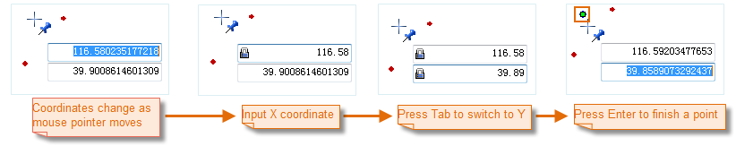

The Point command allows you to draw points. The command is only active if the current layer is an editable point or CAD layer.

### Steps

  1. In the **Draw** group, click **Point**.
  2. When you move the mouse over the map, x and y coordiantes are displayed. Click the map to draw a point.
  3. Repeat the step to draw more points.
  4. Right click to finish drawing.

Note: When typing in a text box, the text box will get locked and the value in the text box will not change when you move the mouse pointer. You can click Tab to switch the focus between the two text boxes. The text box will get unlocked when it gets focus again.

  

  
### Note

To end drawing, you can:

  1. Right click anywhere in the map window.
  2. Click the Point button again.

