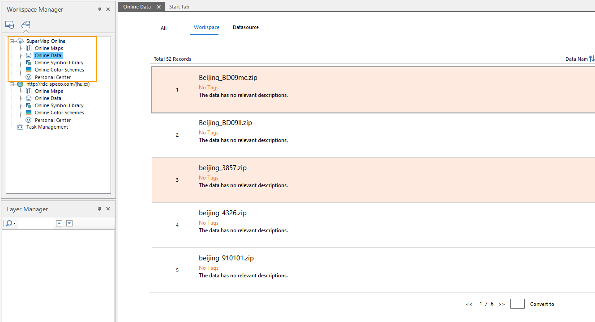
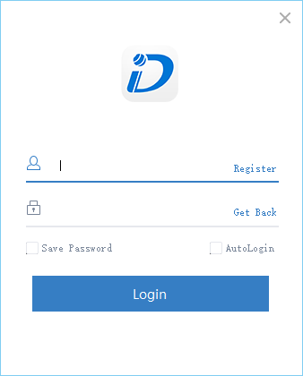
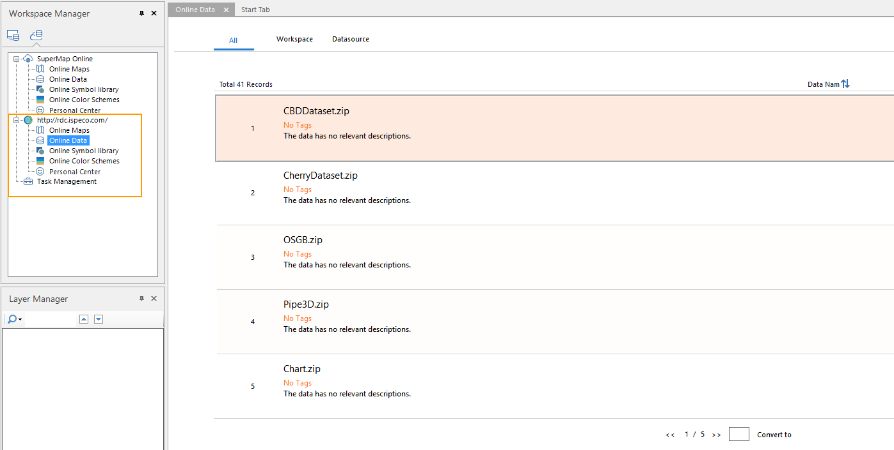

The online services support both accessing to SuperMap Online public cloud
data and the iPortal private cloud data. After configuring SuperMap Online and
iPortal address, you can directly access the data in the cloud service, and
upload the local data.

### SuperMap Online

The address of SuperMap Online is <http://www.supermapol.com>, which has been
predefined in File>Service.If the SuperMap Online services can be accessed,
please access the Online resources like this:

  

  
Log in: Click Online>Account>Visitor>Login, input the registered account to
log in. After logging, users can share data and download the data which is not
open.

  

  
Register: If the user doesn't register a SuperMap account, click Register in
the dialog box, in the pop-up browser page, through the mailbox or mobile
phone number to register an account. When registering with the mail, please
log on your mail in one hour to receive an mail from SuperMap cloud and click
the "Activate Account" button to complete the activation.

### iPortal

In File>Service, users can add and manage the iPortal address. It supports
adding multiple iPortal URLs, but only can show an iPortal URL in current
iDesktop. The service management methods are as follows:

  1. Click File>Service to open the dialog.
  2. Click the Add Service button in SuperMap iPortal part, input the available iPortal service address.
  3. Add: there two adding modes, one is to only add, the other one is to log-in and add, which is to add the address to the list and log in the iPortal account.
  4. Set as Current iPortal: select an address in the iPortal list, click the  button, or right click to select Set as Current iPortal, then in the online workspace, the current iPortal services can be viewed.
  

  5. Login: Click the Login button, and input your account, then you can download the iPortal private data and share the local data.
  6. Register: Click the Register button to register an account. After the account is validated successfully, it can be used to log-in.
  7. Modify Link: when the iPortal service is changed, click the Modify Link to input the URL again.

### Related Contents

 [Online Maps](OnlineMap)

 [Online Data](OnlineData)

 [Online Color Scheme](OnlineColorSchemes)

 [Online Symbol Library](OnlineSymbol)

 [My data](OnlineMyData)

