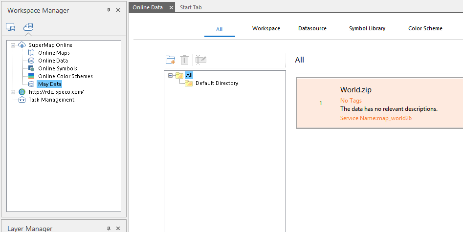
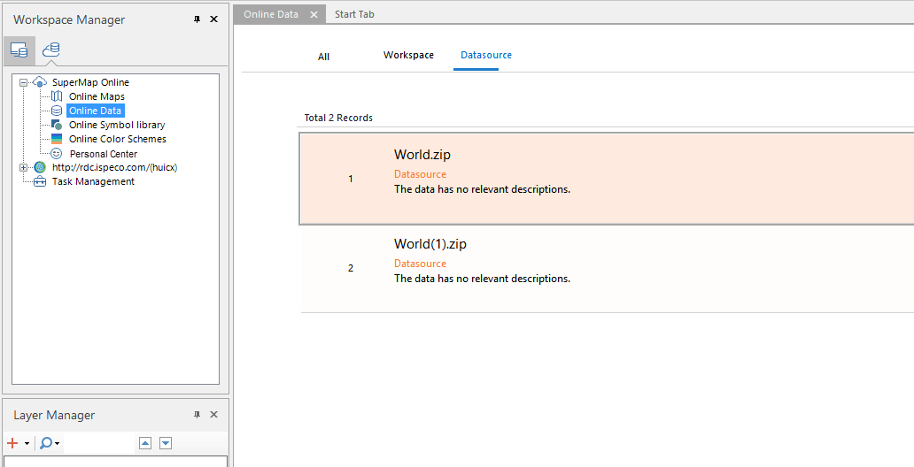

SuperMap online data includes two kinds of data which are work space and data
source, and it can upload local data to SuperMap Online or iPortal for other
users to download and use. In the "Cloud Data" panel, click the "Online Data"
node to view the online data in the current server.

### Online workspace

In the "Cloud Data" panel, click the "Online Data" tree node and click the
"Workspace" tab the right panel to view the online workspace in the service
address. The online workspace comes from the data that is uploaded when the
map is shared, and the workspace data shared by the user. User login account,
and can download the work space to local use.

**Upload workspace**

**Function Entrance**

Right-click the workspace node in the workspace manager and select **Upload
Workspace...** to pop up the **Upload Workspace** panel.

**Parameter Description**

Set the following parameters in the panel:

  * **Select Data** : Displays the name of the currently open workspace.
  * **Name** : Sets the display name after the workspace has been uploaded.
  * **Icon** : Click the icon, in the pop-up "Open" dialog box, select the image file as the workspace icon, in the browser access[SuperMap Online](https://www.supermapol.com/) Or Iportal service address, it will be displayed on the details page of the data. Picture support formats are: *.png, *.jpg. *jpeg, *.bmp.
  * **Keywords** : Enter the workspace keywords, facilitate data search, and multiple keywords need to be separated by semicolons.
  * **Description** : You can enter a description of the workspace in this text box to help other users quickly understand the main content in the workspace.
  * **Upload address** : set the map hosting service address, and drop-down list shows the address of SuperMap Online and the current iPortal, click the drop-down button to select.
  * **Upload directory** : Click the right button, in the pop-up "Select Directory" dialog box, select or create a new post-upload workspace storage directory. The "Select Directory" dialog box supports operations of directory management, include return to the previous level, rename, create a new directory, delete, and so on.
  * **Public Object** : Supports setting up the map to share the object, if the upload address is Online, you can set whether the map is visible to anyone; if the upload address is iPortal, you can set whether the map is visible to anyone or group, and support the specified visible group.

when you upload workspace, you can choose whether to share the work space in
the map, and if you want to share a map in the workspace, you can switch the
"Upload Workspace" panel to the "Map" option interface, check the shared map,
and set the following parameters. Share the specified map with the workspace:

  * **Select Map** : Show all the maps in the current workspace, and check the map to be shared.
  * **Icon** : Click the picture in the icon box, select a picture in the pop-up dialog box to display the main contents of the map. The supported formats are: *.png?*.jpg.*jpeg?*.bmp.
  * **Keywords** : map keywords can be used for map grouping and search which can be entered directly in the text box, and multiple keywords need to be separated by semicolons.
  * **Description** : You can enter the description of the map content in the text box, so that other users can quickly understand the map content.

After setting the above parameters, click the "Share" button in the "Upload
Workspace" panel to upload the workspace and the map to SuperMap Online or
iPortal. You can view the upload progress in the "Task Management" panel.

Once the upload is successful, you can view and download the data in "My Data"
for , as shown in the following figure.

  
  
### Online data source

In the "Cloud Data" panel, click the "Online Data" tree node and click the
"Data Source" tab the right panel to view the online data source in the
service address. The online data source comes from the data that is uploaded
when the map is shared, and data source shared by the user. User login
account, and can download the work space to local use.

**Upload data source**

**Function Entrance**

Right-click the data source node of the workspace manager and select "Upload
Workspace ..." to pop up the "Upload Workspace" panel and set the following
parameters in the panel:

**Parameter Description**

Set the following parameters in the panel:

  * **Select Data** : Displays the current data source name to be uploaded.
  * **Name** : Sets the display name after the data source has been uploaded.
  * **Icon** : Click the icon, in the pop-up "Open" dialog box, select the image file as the workspace icon, in the browser access [SuperMap Online](https://www.supermapol.com/) Or iPortal service address, it will be displayed on the details page of the data. Picture support formats are: *.png, *.jpg. *jpeg, *.bmp.
  * **Keywords** : Enter the data source keywords, facilitate data search, and multiple keywords need to be separated by semicolons.
  * **Description** : You can enter a description of the data source in this text box to help other users quickly understand the main content in the data source.
  * **Upload address** : set the data source upload service address, drop-down list shows the address of SuperMap Online and the current iPortal, and click the drop-down button to select.
  * **Upload directory** : Click the right button, in the pop-up "Select Directory" dialog box, select or create a new post-upload data source storage directory. The "Select Directory" dialog box supports operations of directory management, include return to the previous level, rename, create a new directory, delete, and so on.
  * **Public Object** : Supports setting up the map to share the object, if the upload address is Online, you can set whether the map is visible to anyone; if the upload address is iPortal, you can set whether the map is visible to anyone or group, and support the specified visible group.

After setting the above parameters, click the "Share" button in the "Upload
Data Source" panel to upload the data source package to the specified server
address. During uploading, you can view the progress of the upload in "Task
Management".

Once the upload is successful, you can view and download the data in the
"Online data" list.

  
---  
  
### Download Data

In the "online data" data list, select the workspace or data source which the
user wants to download, click the "download" button, select the data download
path, click "OK" button, and you can download the selected data to the
specified path. In the download process, you can view the progress of the
download in the "Task Management" dialog box, it will automatically extract
the data in the storage path after the download is successful, and the user
can directly open the data in the .

### Related Contents:

 [Configuration service](ConfigureAddress)

 [online map](OnlineMap)

 [Online color scheme](OnlineColorSchemes)

 [Online symbol library](OnlineSymbol)

 [My data](OnlineMyData)

