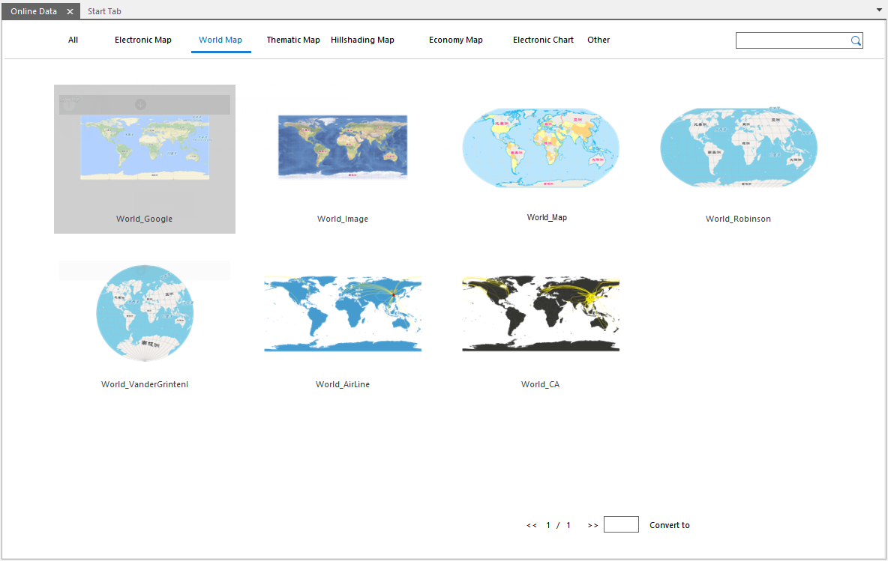
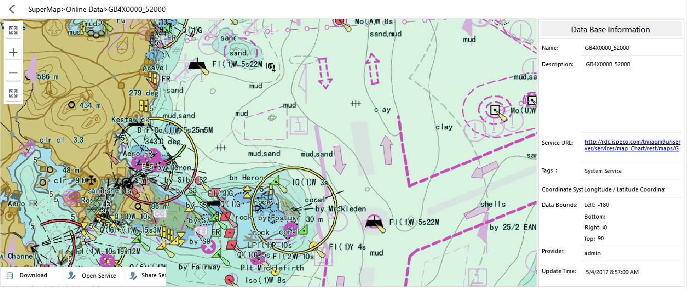

SuperMap online map which has prepared a map through the SuperMap iDesktop,
SuperMap Online, iPortal, the map will be hosted on SuperMap Online or
iPortal, and the user can access the shared map through the desktop or the
browser. SuperMap online map support browsing, sharing services, download and
other operations, while supporting the local map uploaded to SuperMap Online
or iPortal, for other users to browse and download.

In the workspace manager click **Cloud Data** > **Online Maps** to view online
maps in the service address. All online maps are divided into electronic map,
the world map, thematic map, shading , Economic zone map, electronic chart.

  
 
  
### **View the map**

  * **Map preview** : Click a map in the map, you can preview the map in the current window, and map preview support zoom in, zoom out, full-width display and other operations. While browsing the online map, you can view the map's name, detailed description, service URL, coordinate system, data range, provider, update time and other information on the right side of the map, as shown in the following figure:    
 
  * **Open the service** : Click the "Open Service" button in the lower right corner of the map to open the map service as a Web data source in the current workspace and open the map in the map window. The user can use the map as a bottom figure, and draw a map on the basis of map.
  * **Share Service** : Click the "Share Service" button in the lower left corner of the map, pop-up "Map Service" dialog box, and the map shows the service address and address of the QR codes, and you can share the address link or QR code to friends.
  * **Guess you like** : When the user opens the map to preview, the map window will display the map which you may be interested in based on the name and label of the map you open, and you can click it to browse directly.

### **Download Map**

SuperMap Online provides rich map resources, and users can download the map
data to the local use according to their own preferences and needs. Before you
download the map, you need to log in. Note: If you want to download the data
in SuperMap Online, you need to log in to SuperMap Online. If you need to
download the data in iPortal, you need to log in to iPortal's account.

After logging in, click to view the map of interest in the online map list.
Click "Download Data" in the lower left corner of the map preview window,
select the storage path of the map data, click "OK" button to start Download,
"Task Manager" dialog box poped up can view the progress of data download.
After the success of the download, it will automatically extract in the
specified directory and open the data directly in the .

### **Share Map**

Supports to share the local map to SuperMap Online or iPortal for other users
to view and download. The shared map can be browsed and perform Interactive
operation on the browser, the desktop, and the users who have authority can
download the map. The specific operation is as follows:

**Function Entrance**

In the Map Tree node of the Workspace Manager, select the map you want to
share, click the right mouse button, and select the "Share Map ... " option to
pop up the "Share Map" panel as shown in the following figure.

**Parameter Description**

In the Map tab of the Share Map panel, set the following parameters:

  * **Select Map** : The table shows all the maps in the current workspace, and check the map to be shared.
  * **Map icon** : the application will generate the default icon based on the map content, and the user can click the icon to select a local image file as a map icon. Formats which picture supports include: *.png, *.jpg, *.jpeg, *.bmp.
  * **Keywords** : map keywords can be used for map grouping and search which can be entered directly in the text box, and multiple keywords need to be separated by semicolons.
  * **Introduction** :You can enter the description of the map content in the text box, so that other users can quickly understand the map content.
  * **Upload address** : set the map hosting service address, and drop-down list shows the address of SuperMap Online and the current iPortal, click the drop-down button to select.
  * **Public Object** : Supports setting up the map to share the object, if the upload address is SuperMap Online, you can set whether the map is visible to anyone; if the upload address is iPortal, you can set whether the map is visible to anyone or group, and support the specified visible group.

When Sharing the map, it is necessary to upload with the work space, in the
"Share Map" of the "Workspace" option, set related parameters of the upload
workspace.

  * Select Data: Displays the name of the currently open workspace.
  * Name: Sets the display name after the workspace has been uploaded.
  * Icon: Click the icon, in the pop-up "Open" dialog box, select the image file as the workspace icon. Formats which picture supports include: *.png, *.jpg, *.jpeg, *.bmp.
  * Keywords: Enter the workspace keywords, facilitate data search, and multiple keywords need to be separated by semicolons.
  * Introduction: You can enter a description of the workspace in this text box to help other users quickly understand the main content in the workspace.
  * Upload directory: Click the right button, in the pop-up "Select Directory" dialog box, select or create a new post-upload workspace storage directory. The "Select Directory" dialog box supports operations of directory management, include return to the previous level, rename, create a new directory, delete, and so on. 

Once you have set the above parameters, click the "Share" button in the "Share
Map" panel to share the workspace where the map machine is located to the
specified service station platform (SuperMap Online or iPortal). During the
upload process, you can view the progress of the data upload in the "Task
Management" dialog box and support the suspension or deletion of the upload
task.

Once the map is shared, click "Map Online" in the "Cloud Data" panel to view
the shared maps in the map list, and you can also view and download the shared
workspace in the "Workspace" data list.

### Related Contents:

 [Configuration service](ConfigureAddress)

 [Online data](OnlineData)

 [Online color scheme](OnlineColorSchemes)

 [Online symbol library](OnlineSymbol)

 [My data](OnlineMyData)

