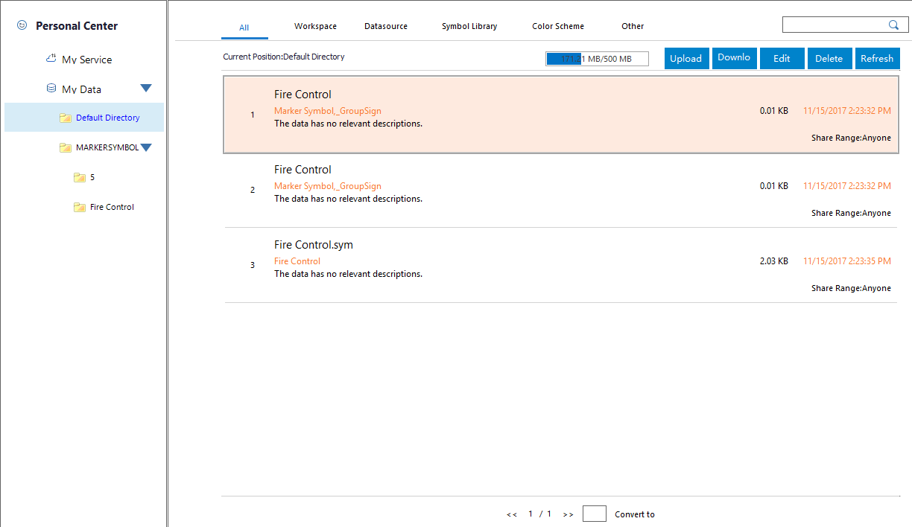

### Introduction

Login SuperMap Online and iPortal, and then in the "Personal Center" you can
manage your online resources on "My Service" and "My Data".

In Online data panel of the Workspace Manager, click the Super online node or
iPortal node. Click "Personal Center" to open the "Online Data" window, and
then in the window you can click "My Service" or "My Data" to view related
content.

  
 
  
### My Service

Data in "My Service" is map services that you have published. You can view,
edit and delete these map services.

  * "**View**": All your published or shared services can be shown as the sort of service names, update time or visit count.
  * "**Search**": You can directly enter whole or part of name of the file you want to search to find out it quickly.
  * "**Edit**": Choose a service item from the service list, then click "Edit" button to open the "Edit Private Service" dialog box where you can modify the name, tag, description, and view permission for the service.
  * "**Delete**": Choose a service item from the service list, then click "Delete" to delete it from "My Service".
  * "**Refresh**": Click "Refresh" button to refresh current data list.

### My Data

All data you have uploaded to your account is shown in "My Data" tab.

  * At the top of the Online Data window, the data is divided into the following four types according to the type : Workspace, Datasource, Symbol Library, Color Scheme. Click on different tab page, which displays different types of data packets. No-classified data can be viewed in the "All" tab page.
  * You can create directories at the left of the online data window to group your data as file names. Right click a file directory, you can delete or rename it. You can also create a new directory. 
  * Both SuperMap Online and iPortal provide 5GB of space size for saving your data.
  * You can upload, download, delete, refresh your data by using buttons in the toolbar.

  1. "**Upload**": The currently open workspace, Local datasources, symbol libraries, and color scheme, etc. Click "Upload" to open the Upload Data dialog box. And then specify the type of data you want to upload. The data type could be:
    * **Workspace** : If you want to upload local or opened workspaces, you can specify the data type as "Workspace" and then click "OK" to open the "Share" panel where you can set the workspaces that you want to share.
    * **Datasource** : Specify the data type as "Datasource" and then click "OK" to open the "Share" panel where you can set the local datasources or currently opened datasource that you want to share. The uploaded UDB datasources will be published as the REST service.
    * **Symbol library** : Specify the data type as Marker/Line/Fill resources and click OK to open the corresponding symbol manager, and so select all symbols you want to upload and right click, next, select "Share to Online".
    * **Color Scheme** : Specify the data type as "Color Scheme" and click "Ok". In the pop-up "Color Scheme Manager", select all symbols or symbol groups you want to upload, then right click and select "Share to Online".
    * **Other** : Specify the data type as "Other". In the pop-up "Open" dialog box you can select any files in any formats to upload.

After you determine all files you want to upload, the "Task Management" dialog
box will show the progress bar, and you are allowed to pause, cancel or delete
the uploading files.

  2. Download: Select a data item in the data list and click the "Download" button to download it to your machine. Function is the same with data item in the upper right corner.
  3. Delete: Select a single data item in the data list and click the "Delete" button to delete it from my data. Function is the same with data item in the upper right corner.
  4. Refresh: Click the "Refresh" button to refresh the current data list. 

### Related Contents:

 [Configuration service](ConfigureAddress)

 [online map](OnlineMap)

 [Online data](OnlineData)

 [Online color scheme](OnlineColorSchemes)

 [Online symbol library](OnlineSymbol)

