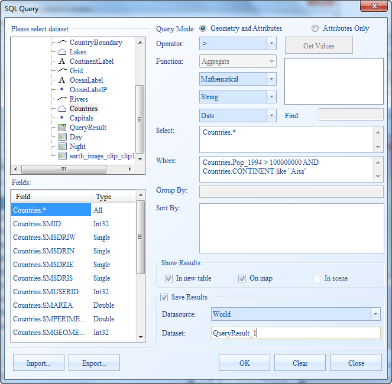
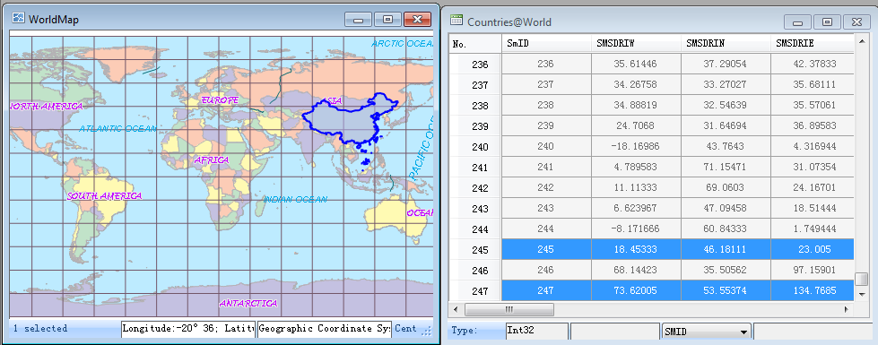

This example shows how to query Asian countries with the population of more than 100 million in 1994.

1\. Open World.smwu. The query dataset is the World region dataset.

2\. On the **Spatial Analysis** tab, in the **Query** group, click **SQL Query** to display the SQL Query dialog box.

3\. In the SQL Query dialog box, select the Countries dataset, double click World.* in the Fields box to set the query field to Countries.*, set the query condition to World.POP_1994 > 100000000 AND World.COLOR_MAP Like "4". Then check the On map box to show the query results on map and check the Save Results box to save the results as a new dataset. as shown below.

  
---  
  
4\. View the query results.

The window mode is switched to Related to display both the WorldMap and the attribute table of the query results. Meanwhile, the query results are highlighted on the map. You can locate to a country by selecting the corresponding record in the attribute table of the query results.

  
---  
  
### Note

  1. The World.COLOR_MAP and World.POP_1994 fields store the country color and population information in 1994 respectively. We join the two conditions with AND to select records meet both conditions.
  2. You need to select the dataset containing features you want to query in the Please select dataset box.
  3. If the corresponding feature is not displayed on the map when you select a record in the attribute table, clear the [visible scale range settings](../Visualization/AdvanceSetting/ScaleRanges).

