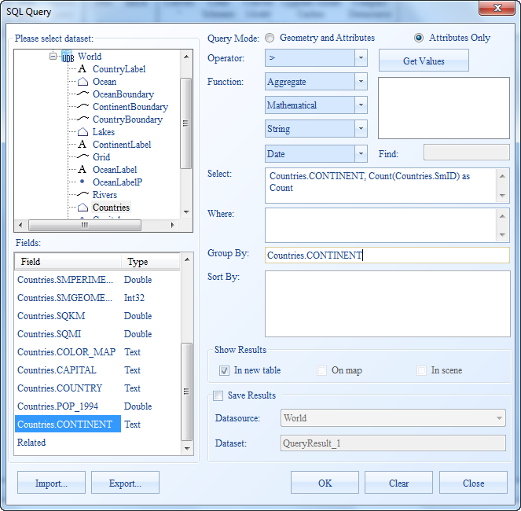
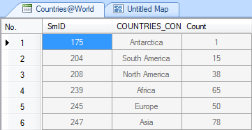
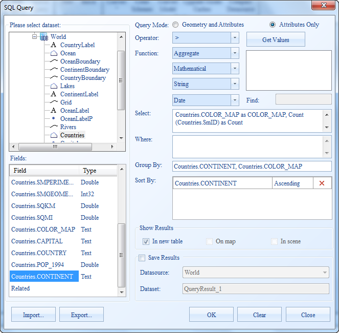
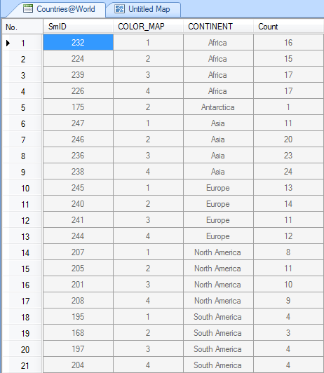

Except for querying objects in the general way, SQL Query allows you to group the results by one or more fields and get temporary fields for statistical results obtained through aggregation functions, mathematical functions, etc.

### Group by Single Field

This example shows how to get statistics on the number of World on each continent.

  1. On the **Spatial Analysis** tab, in the **Query** group, click **SQL Query** to display the SQL Query dialog box.
  2. Set the SQL Query dialog box: 

Query Mode: Attributes Only

Select: World.CONTINENT, Count(World.SmID) as Count

Group by World.CONTINENT

as shown below.

  
---  
  
Click OK to get the statistics describing the number of World on each
continent. The temporary filed Count is used to store the statistical results
obtained from Count(World.SmID). The statistical results are displayed in the
figure below:

  
---  

### Group by Multiple Fields

You can also get statistics on several fields. If you set several group fields
in the Group By box, the result records are firstly grouped by the first
field, then the grouped results are grouped by the second filed, and so on.

This example shows how to group the numbers of World on all continents are
grouped by map colors stored in World_World.COLOR_MAP.

  1. Open World.smwu, and the query dataset is World.
  2. On the **Spatial Analysis** tab, in the **Query** group, click **SQL Query** to display the SQL Query dialog box.
  3. Set the SQL Query dialog box: 

Query Mode: Attributes Only

Where: World.CONTINENT as CONTINENT, World.COLOR_MAP as COLOR_MAP,
Count(World.SmID) as Count, World.SmID;

Group by: World.CONTINENT, World.COLOR_MAP;

Sort by: World.CONTINENT

as shown below.

  
---  
  
The numbers of World on all continents are grouped by map colors and sorted by SMID. The statistical results are displayed in the figure below:

  
---  

