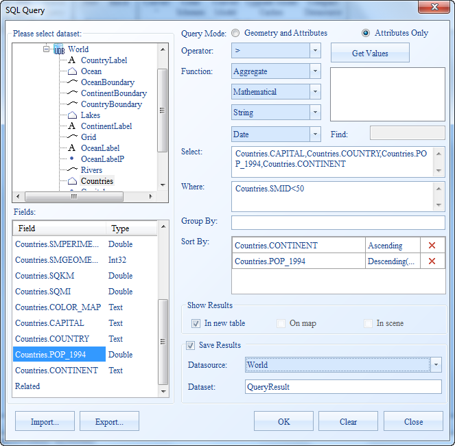
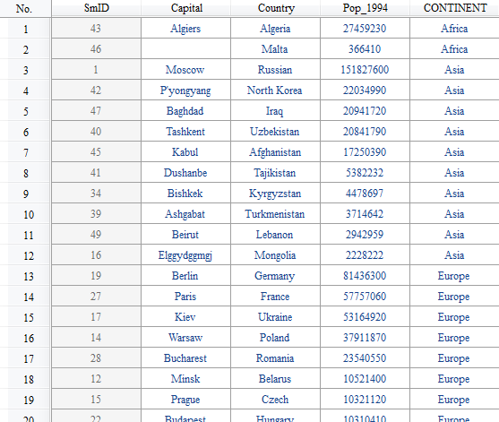

SuperMap SQL Query can order the query result according to fields. The records can be ordered by the first specified field, then the second, and so on. Finally, the order result can be obtained.

Take the World data as an example. Query the attribute information with SmID <50. The result is ordered by the continent ID, and then by the population of the country.

  1. Open World.smwu and the query dataset is World. 
  2. Select **Spatial Analysis** > **Query** > **SQL Query**.
  3. Set the following parameters in the SQL Query dialog box: 

Query Mode: Attributes Only

Field: World.CAPITAL,World.COUNTRY,World.Popu_1994,World.ContinentID

Condition: World.SMID < 50;

Sort by: World.ContinentID and World.Popu_1994.

As shown below.

  

  
The order result based on World.ContinentID and World.Popu_1994 is shown as follows:  

  

