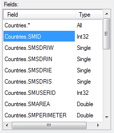
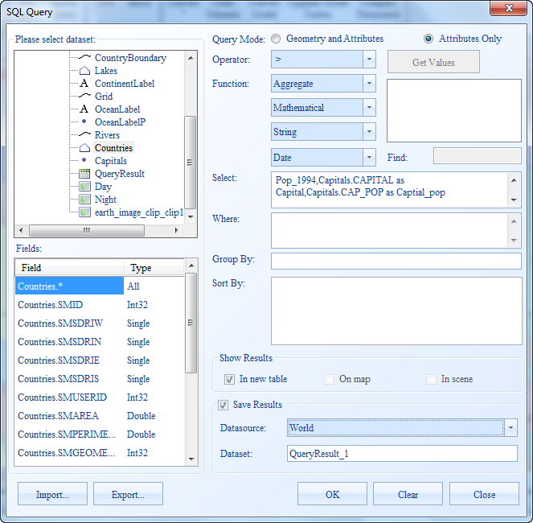
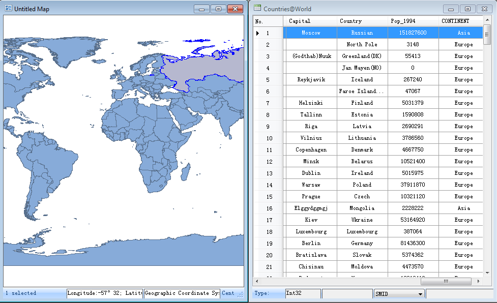

Cross Table Query allows you to query data from more than one table based on the relationship between certain fields in these tables. This example shows you how to query the county population and capital population from two different datasets. 

### Data Involved:

(1) In the World dataset, the capitals (Capital), World (Country) and the population of the World (Pop_1994) are store.

(2) In the Capitals dataset, the capitals (Capital) and the population of the capitals (Cap_Pop) are stored.

### Basic Ideas:

Relate the World and Capitals datasets with the common filed--Capital. Query based on the relationship built between the two datasets and get a new dataset describing the country, capital, country population and capital population.

### Steps:

1. Open World.smwu and double click World to display the dataset in an Untitled Map.

2. On the **Spatial Analysis** tab, in the **Query** group, click **SQL Query** to display the SQL Query dialog box.

3. In the SQL Query dialog box, select the World dataset and click the Related item at the bottom of the dialog box.

4. The Relate dialog box shows up. Set the Related Dataset, Source Field, Related Field, and Join Type to Capitals, Capital, Capital and Left Join respectively.

  
---  
  
5. Set the Query Mode to Geometry and Attributes, then type World.COUNTRY as Country,World.POP_1994 as Country Population,Capitals.CAPITAL as Capital,Capitals.CAP_POP as Capital Population in the Select box. as shown below.

  * **Query Mode** : set to Query Spatial and Attributes.
  * **Fields** : ProvinceCapital_P.Name,Temperature_Jan_P.TemperatureAverage as TemperatureAverage_Jan;
  * Don't set a query condition.
  * Check **Highlight in Map** in the **Show Results** area. 
  * **Save Results** : set the resulting datasource name and dataset name.

As the following picture shows

  
---  
  
6. View the query results.

The QueryResult dataset generated from the query has the same type with the World dataset. The Country, Country Population, Capital, Capital Population and some system fields compose the attribute table of the result dataset.

The window mode is switched to Related to display both the Untitled Map and the attribute table of the query results. Meanwhile, the query results are highlighted on the map. You can locate to a country by selecting the corresponding record in the attribute table of the query results, as shown below.

  
---  
  
### Note

  1. **Join Type:**

The Left Join returns all records from the source dataset, even if there are no matches in the related dataset. If the record in the World dataset has matched record in the Capitals dataset, the Capital Population field is filled with the value from the Capitals dataset. If the record in the World dataset doesn't have matched record in the Capitals dataset, the Capital Population field is null.

The Inner Join returns records when the specified field matches in both datasets. If the record in the World dataset doesn't have matched record in the Capitals dataset, the record will be removed from the result dataset.

The following figures illustrates the two join types.

**Source Table** | **Related Table** | **Left Join Results** | **Inner Join Results**  
---|---|---|---  
| Source Field | Field 2  
---|---  
1 | 1A  
2 | 2B  
3 | 3C  
4 | 4D  
| Related Field | Field 3  
---|---  
1 | 10  
2 | 20  
3 | 30  
5 | 50  
| Related Field: | Field 2 | Field 3  
---|---|---  
1 | 1A | 10  
2 | 2B | 20  
3 | 3C | 30  
4 | 4D |  
| Related Field: | Field 2 | Field 3  
---|---|---  
1 | 1A | 10  
2 | 2B | 20  
3 | 3C | 30  
|  |  
  2. **Relate Fields:**

If many records have the same value in the source field, the relation between the source and related tables might be many to one. For instance, the source table stores the provincial information and the related table stores the national information. When you relate the two tables, the relation of many provinces to one country exists in the result table and the many to one relation is meaningful.

If many records have the same value in the related field, the relation between the source and related tables might be one to many. In this situation, the last record of a value in the related table will be kept for establishing the relation between the two tables.

To ensure the accuracy and predictability of the results, it is suggested that you ensure the related field can uniquely identify each record of the related table.

