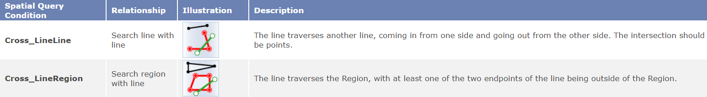
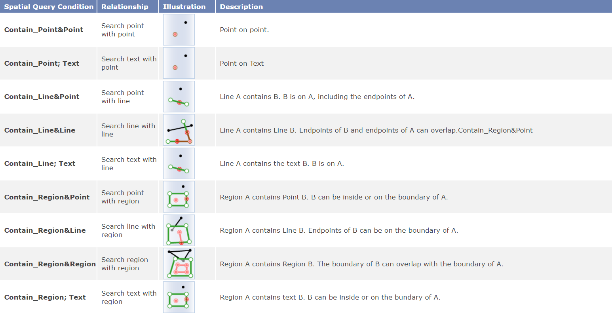
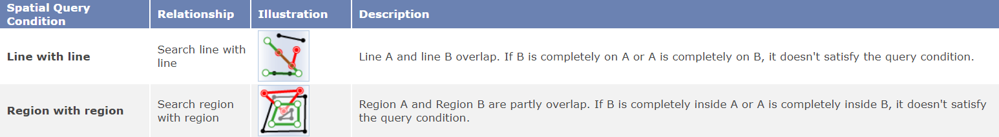
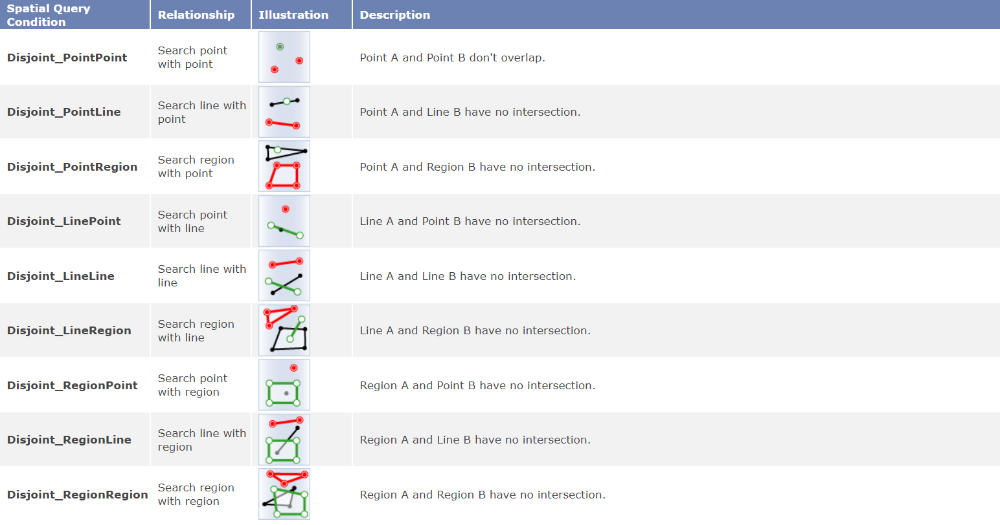
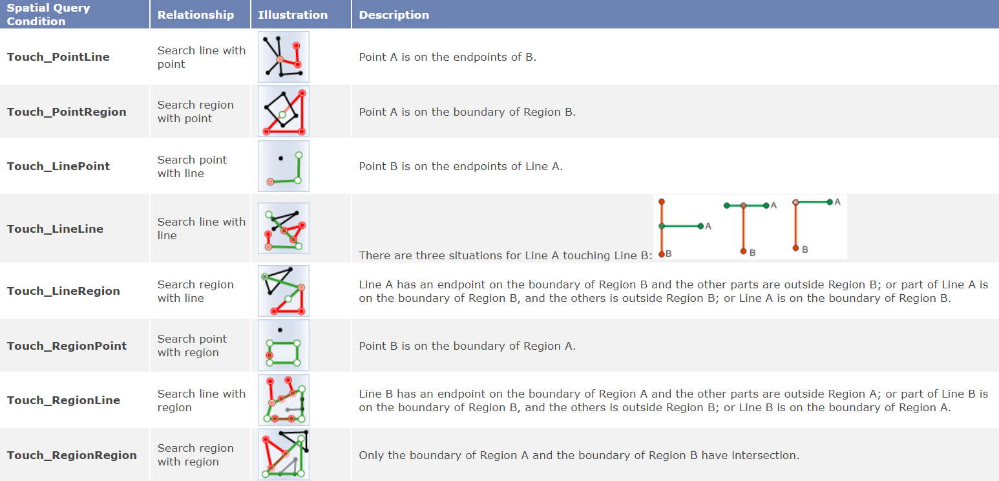
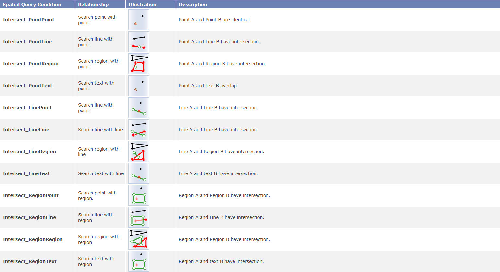

Spatial query is a query method that selects map features based on their
spatial relationships to other feature. Currently, 8 spatial query operators
are supported. They are: Cross, Contain, Within, Overlap, Disjoint, Touch,
Identity, Intersect.

The 3 features involved are: the searching object, the searched layer, and the
result recordset. The illustration for each operator depicts the searching
object and the result dataset. The searching object is in green, the searched
layer is in black, and the result recordset is in red.

### Cross

Return line or region objects in the searched layer (line, region. CAD)
crossed by the searching object (line).

-  Relationship: The searching object (A) crosses the searched object (B).
-  Search line with line: The line traverses another line, coming in from one side and going out from the other side. The intersection should be points. The intersection of the interior of A and the interior of B cannot be null and the topological dimension is 0.
-  Search region with line: The line traverses the Region, with at least one of the two endpoints of the line being outside of the Region.

**Cross Operators:**

 
  
### Contain

Return objects (point, line, region, TExt, CAD) in the searched layer contained by the searching object (point, line, region). It is not necessary to be fully contained. It is OK to have boundary intersection.

-  Relationship: Searching object A contains searched object B (boundary intersection of A and B can be not 0).
-  The intersection of the exterior of A and the interior of B is null and the intersection of the interior of A and the interior of B is not null, or the boundary of A and the interior of B have no intersection. 
-  Dimensions of A >= Dimensions of B

**Contain Operators:**

  
### Within

Return objects in the searched layer (point, line, region, CAD) that contain
the searching object (point, line, region). Returned regions must fully
contain (including boundary touch) the searching object; returned lines must
fully contain the searching object; returned points must be identical to the
searching object.

-  Relationship: The searched layer B contains the searching object A. It is the opposite of Contain.

**Within Operators**

  
### Overlap

Return objects in the searched layer (line, region, CAD) that are partly overlapped with the searching object (line, region).

- Relationship: The searching object (A) overlaps with the searched object (B).
- Dimension of A is identical to the dimension of B.
- The intersection (C) of the interior of A and the interior of B is not null, the exterior of A and the interior of B cross, and the exterior of B and the interior of A cross.
- The type of C is identical to that of A.

**Overlay Operators**

 
  
### Disjoint

Return objects in the searched layer (point, line, region, CAD) disjoint with the searching object (point, line, region).

- Relationship: The searching object (A) is disjoint with the searched object (B).

**Disjoint Operators**

**Touch Operators**

  
### Identity

Return objects in the searched layer (point, line, region, CAD) that are fully overlapped with the searching object (point, line, region). The object type and coordinates must be the same.

- Relationship: The type of the searching object A and the type of the searched object B must be the same, the intersection of the interior of A and the interior of B is not null, the intersection of the boundary of A and the exterior of B is null, the interior of A and the exterior of B is null, and the vertices can be not identical. 

**Identity Operators**

 
  
### Intersect

Return objects (point, line, region, Text, CAD) in the searched layer that are
intersected with the searching object (point, line, region).

- Relationship: The searching object (A) intersects with the searched object (B).

**Intersect Operators**

