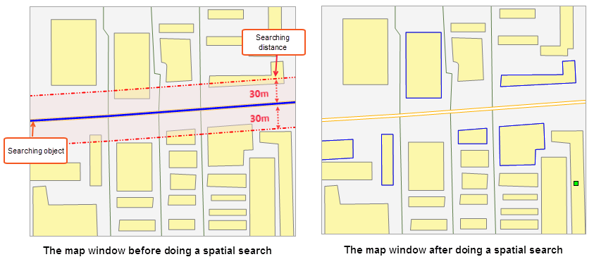

### Description

The Spatial Query command is used to compose filter expression according to the spatial relationship among geometric objects and get objects satisfying the filter condition from the existing data. Spatial query on point, line, and region objects are currently supported.

### Function Entrances

  * Ribbon: **Spatial Analysis** > **Query** > **Spatial Query**.

To use the feature, you should open at least one of non-null point, line, region, text, and CAD datasets. After opening the **Spatial Query** dialog, you can search objects from the opening map.

###  Operating Instructions

  1. Select the searching object for spatial query in the map window. For instance, you want to expand a road, then the corresponding line object is the searching object.
  2. Specify the searching layer, that is, where the objects to query are located. For instance, you want to search all residential areas beside a road, then the residential-area layer is the searching layer. 

If there are selected geometric objects in the map window, the Searching Layer dropdown list in the Spatial Query dialog box will list all layers that have geometric objects selected. You can select a layer from the Searching Layer dropdown list.

All layers that could be searched in the map window are listed in the table. The layer could be non-empty point, line, region, text and CAD layers. Check or uncheck the check box ahead to specify whether to perform the spatial query on the corresponding layer.

  3. Set the spatial query conditions and attribute query conditions for the searched layers.

Spatial Query Condition: In the layer list, click the Spatial Query Condition dropdown button and select a spatial operator from the dropdown list that shows up. Once a spatial operator has been selected, the illustration and explanation of it will display below the layer list. Currently, 8 spatial operators are supported. For more details, please refer to [Basic Spatial Query Operators](SQ_BasicOperators).

Attribute Query Condition: In the layer list, click the Attribute Query
Condition dropdown button and select Expression from the dropdown list that
shows up. Compose the attribute query condition in the [SQL
Expression](SQLDia) dialog box that shows up. For instance, to query the
cities that a river passes by and have the population greater than 1 million,
the SQL expression could be the population field > 1000000\. Also, you can
leave the attribute query condition empty to query all geometric objects that
satisfying the spatial relationship specified.

  4. **Set Query Distance** : Specify the searching distance and its unit. iDesktop will create buffers for the searching object according to the distance first. And then do a search in the buffer areas. For example, you can set the distance to 30 and unit to m when you want to search all residential areas within 30 meters of a road. 

**Note** : In some conditions, the searching distance can not work. The
following tables list all conditions that support or don't support the
distance. **v** denotes the distance can work. **x** denotes the distance
can't work. **\--** means the kind of vector object has no supports to the
spatial operator.

Searching object | Searched object | Cross | Contain | Within | Overlap | Disjoint | Touch | Identity | Intersect  
---|---|---|---|---|---|---|---|---|---  
**Point** | Point | \-- | v | x | \-- | v | \-- | x | v  
Line | \-- | \-- | x | \-- | v | x | \-- | v  
Region | \-- | \-- | v | \-- | v | x | v | v  
**Line** | Point | \-- | v | \-- | \-- | v | x | \-- | v  
Line | x | v | x | x | v | x | x | v  
Region | x | \-- | v | \-- | v | x | \-- | v  
**Region** | Point | \-- | v | \-- | \-- | v | x | \-- | v  
Line | \-- | v | \-- | \-- | v | x | \-- | v  
Region | \-- | v | v | v | v | x | x | v  
  5. Specify how to save results. Select the searched layer, then you can specify how to save the query results for it. 

Save Results: Check the Save Results to save results after query.

* Datasource: The datasource to place the query results. All non-readonly datasources are listed in the dropdown list. You can specify one to place the query results.
* Dataset: The dataset to place the query results. The default name is SpatialQuery_1. 

Only save spatial info: Check the box to save spatial information, not attribute information.

  6. Specify how to display the query results. Select a searched layer and set how to display the query results for it. With multiple check box checked, the 2D and 3D associated browsing of the query results will be realized. 
* Browse in Attribute Table: Check the box to display the query results in the attribute table.
* Highlight in Map: Check the box to highlight the query results in the map.
* Highlight in Scene: Check the box to highlight the query results in the scene.

###  Sample Application

Given road data and residential area data, we want to expanding a road. We can
use the feature to know all residential areas within 30 meters of the road.
Select the road line to be expanded as the searching object and the
residential region dataset as the searched object, set the spatial query
condition to Intersect_RegionLine, Distance to 30, and Unit to m. And then get
the result as the following pictures show.

  
---  
  
### Notes

  1. Only if the searched layer and the searching layer are in the same coordinate system, the spatial query can be performed.
  2. The spatial query condition can only be specified after selecting the query objects.
  3. When the searched layer is the CAD dataset (CAD dataset is a complex dataset, and it may contain point, line, and region geomatric objects), the operators contain all the operators supported by the spatial query of the search objects and point, line and region datasets.

### Related Topics

[Basic Spatial Query Operators](SQ_BasicOperators)

[An Example for Spatial Query](SpatialQuery_Example)

