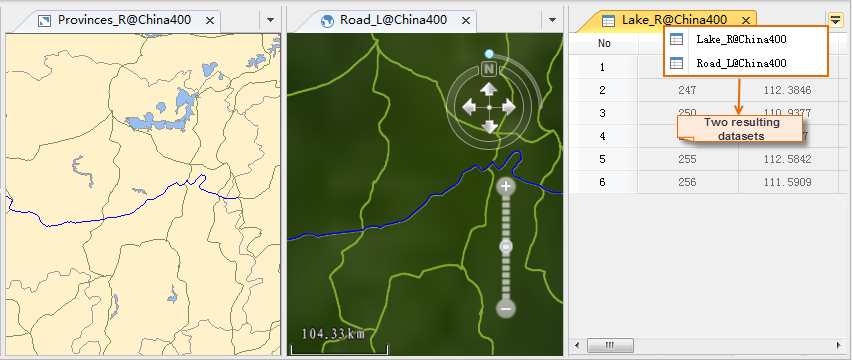

Sample data used in this example is the China400.udb datasource. The road, lake, and administrative region data are involved. Query:

  * Lakes contained in Hunan province.
  * Roads that passes by Hunan province with the road code of G320.

Basic Steps:

  1. Open the China.udb datasource in the current workspace.
  2. Create a new map window and add the three datasets Provinces_R, Lake_R, and Road_L to the newly created map window.
  3. In the map window, select the region indicating the Hunnan province in the Provinces_R layer, that is the searching object.
  4. On the **Spatial Analysis** tab, in the **Query** group, click **Spatial Query** to open the Spatial Query dialog box.
  5. Specify the spatial query condition and attribute query condition for the searched layer. 
    * Click the Spatial Query Condition dropdown button for the Road_L layer in the layer list and select "Intersect_RegionLine" to query roads that pass by Hunan.
    * Click the Attirbute Query Condition dropdown button for the Road_L layer in the layer list, click "Expression", and compose the SQL expression Road_L.CODE = "G320" in the dialog box that shows up.
    * Click the Spatial Query Condition dropdown button for the Lake_R layer in the layer list and select "Contain_RegionRegion" to query lakes in Hunan province.
  6. Select the Road_L and Lake_R layers, check the Browse in Attribute Table, Highlight in Map, and Highlight in Scene boxes.
  7. Select the Road_L, check the Save Results box, specify the target datasource as China.udb, and rename the result dataset as "HunnanRoad_G320". 

Similarly, rename the result dataset for the Lake_R layer as "HunanLake".

  8. Click OK to perform the SQL query.
  9. Browse the query results in the attribute table, on the map, and in the scene simultaneously. Select a record in the result to realize linkage browsing.
  
