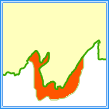

　　Checks your points, lines or polygons as corresponding topological rules and then return the objects that do not match the selected topological rules. 7 topological rules are provided by SuperMap.

 Topology Rules  | Illustration | Introduction     
 :----- |  :---------------: | :------- 
PointNoIdentical |  | Check whether there are some points coincident in the input dataset. The coincident points will be saved in the result dataset as topological errors. For example, some public facilities like schools, fire stations are expressed by using points in a map, and so only one point can exist at the same position.
LineNoOverlap |  | Check whether there are some overlaps between lines in the input line dataset and the overlaps will be saved in the result dataset as topological errors.
LineNoOverlapWith |  | Overlays the input line dataset with another dataset specified in the tool, and then checks whether there are some overlaps between lines and if yes, the overlaps will be saved in the result dataset as topological errors.
RegionContainedByRegion |  | Checks whether there are some polygons not being contained by the referenced polygons. For example, animal areas must be within the entire research range, and if there are some areas are out side of the range, they will be saved in the result dataset as topologically errors.
RegionConveredByRegion |  | Checks whether there are some polygons not being covered by the referenced polygons. For example, an province area must be covered by all its all county areas.
RegionNoOverlap |  | Check whether there are some overlaps between polygons in the input polygon features and the overlaps will be saved in the result dataset as topological errors. For example, between two administrative division areas, any overlap should not exist.
RegionNoOverlapWith |  | Overlays the input region dataset with another region dataset specified in the tool, and then checks whether there are some overlaps between polygons. For example, overlapping water field data with dry land data, overlaps between the two kinds of data should not exist, hence,   you can use the tool and adopt the rule to check topologically whether there are overlaps.

##### 　　Functional Entry

　　There are two functional entries.

- In the "Online" tab and "Analysis" group, select "Check Topology".
- In the "Model Builder" tab click "New" to open the "Toolbox" panel then click "Check Topology" under the "Online Analysis", or drag it into the "Model Builder" window. Double click the function node to open the "Parameter Settings" panel.

##### Parameters

1. **iServer URL**: choose an address for iserver login. For specific instructions, please refer to [data input](DataInputType.html).
2. **Source dataset**: Specify the dataset which will be checked topologically. What types of datasets are shown in the drop-down list depends on the topological rules. For specific instructions on setting source data, please refer to [Data Input](DataInputType.html).
3. **Topology Rules**: Required. Choose one rule from the drop-down list as needed.
4. **Dataset**: When you set the Topology Rules to RegionNoOverlapWith, RegionConveredByRegion, RegionContainedByRegion, or LineNoOverlapWith, you need to specify another dataset to check the source dataset topologically.
5. **Tolerance**: Optional. Set a tolerance for the analysis, and its unit is the same with the unit of the source dataset. The value must be equal to or greater than 0 and 0.000001 is by default.

###  Related Themes

　　 [Environment Configuration](BigDataAnalysisEnvironmentConfiguration.html)

　　 [Data Preparation](DataPreparation.html)

