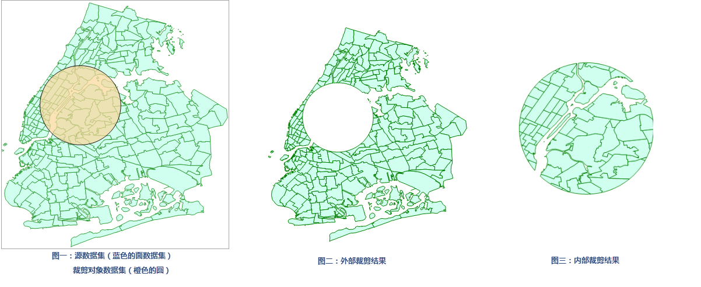

　　Clips the input dataset and saves the result in another dataset.
  
Only one object from the clipping dataset can be used for clipping the input data, and if there are multiple objects in the clipping dataset, the object with the minimum SmID value will be adopted as the clipping object. 

##### 　　Function Entrances

　　There are two functional entries.

- In the "Online" tab and "Analysis" group, select "Vector Clip".
- In the "Model Builder" tab click "New" to open the "Toolbox" panel then click "Vector Clip" under the "Online Analysis", or drag it into the "Model Builder" window. Double click the function node to open the "Parameter Settings" panel.

##### Parameters

1. **iServer URL**: choose an address for iserver login. For specific instructions, please refer to [data input](DataInputType.html).
2. **Source dataset**: specify the dataset which will be clipped by the clipping dataset. Click on the drop-down button and select a dataset from the drop-down list. All of datasets in the drop-down list are filtered out for the analysis.
3. **Clip Data**: Required. Specify which dataset will be used for clipping the source dataset.  
4. **Analysis Parameters**: Specify which part of data in the source dataset will be saved into the result dataset. Inner Clip means saving the part within the clipping range, while External Clip presents the part out of the clipping range will be saved.
5. Click "Execute" to perform the analysis, and the result will be opened automatically on the map window and its path will be output in the output window. 

　　

###  Related Themes

　　 [Environment Configuration](BigDataAnalysisEnvironmentConfiguration.html)

　　 [Data Preparation](DataPreparation.html)

