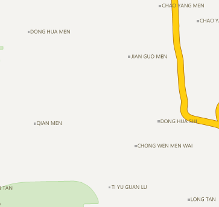
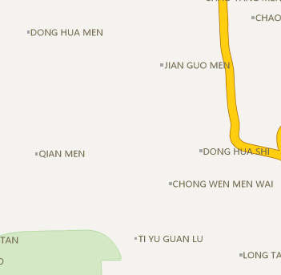

### Compatible with Office Font

Font size in SuperMap maps are not consistent with Office font. For text with the same size, SuperMap will display smaller font than Microsoft Office font. In the Map Properties panel, check Office font compatible ti enable compatibility mode to display font in SuperMap maps with the same standard as Microsoft Office standard.

While creating a new map window, the compatibility mode will be enabled by default.

 |   
---|---  
Before checking Office font compatible | After checking Office font compatible  