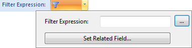
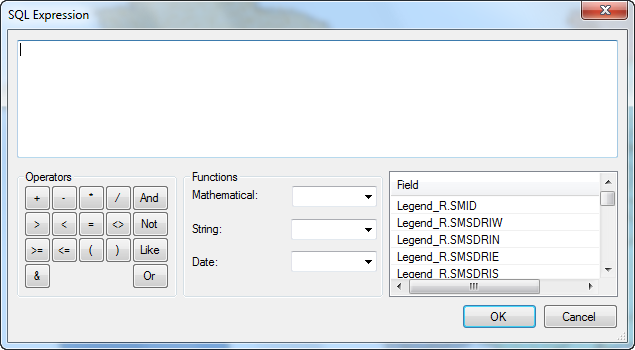
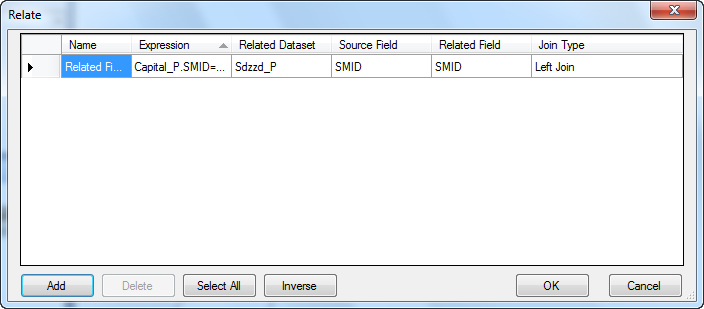

---
id: FilterObjects
title: Filtering Map Objects
---  

The Layer Properties tab provides commands filtering objects in layers.

  
Figure: The Filter group  
  
### Filter Expression

Set filter expression to display objects meeting the condition.

  
Figure: Set filter expression  

You can see Filter Expression dialog box as shown below. In the dialog box, you can either directly type a SQL expression in the Filter Expression text box or click the button with ellipse  to the right to display the [SQL Expression dialog box](../../Query/SQLDia.htm), in which you can compose a SQL expression.

  
Figure: The SQL Query dialog box  
  
Click the Set Join Attribute Table... button to display the [Relate](../../Query/JoinItemsDia.htm), in which you can establish the relationship between tables for composing filter expression with fields from related tables.

  
Figure: The Relate dialog box  