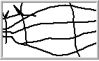

---
id: LineAntialiasing
title: Enabling Line Antialiasing
---  
### Antialias Line

Smooth the lines with an antialiasing algorithm.

 |   
---|---  
Before antialiasing | After antialiasing  
  
### Enabling Line Anti-aliasing

In the Map Properties tab, check Antialias Line box to enable line
antialiasing. If this check box is not checked, the antialiasing effects will
not be applied to lines on the map.

### Note

* If you cannot see any effect after checking the box, you can check Antialiasing option in the Layer Properties panel. Layer antialiasing and map antialiasing must be enabled.
* The line antialiasing takes effect only when layer transparency is 0.

