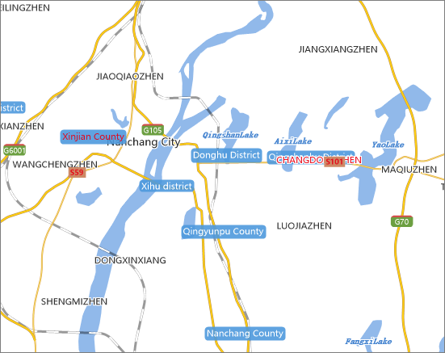

### Collision Detection

Text label is a simple way for identifying features in the map through descriptive text. The text label in the map is dynamically displayed, and all map labels cannot display at the same time because of the space limit. Through clicking the Collision Detection button in the Performance group on the Map tab, users can view conflicted labels. After enabling the collision detection, a label conflicts with itself will be marked pink; while labels conflict with other labels with be marked red.

  
  
### Note

A label that conflicts with itself often happen for along-line labels.

