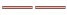
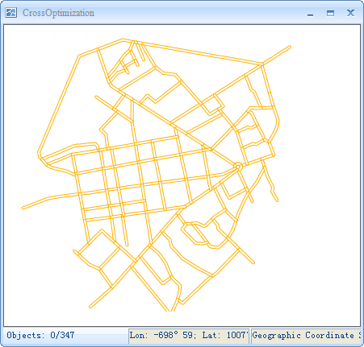
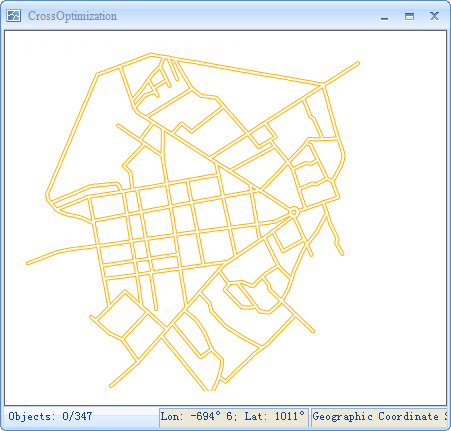

---
id: RoadCross
title: Enabling Cross Optimization
---  

### Cross Optimization

In line layers, lines often intersect with each other. It is not beautiful and can not show the connectivity between the two line objects.

As shows in the figure below, it is often needed to optimize intersect lines and remove the intersection parts at the cross.

 |   
---|---  
Not use cross optimization | Use cross optimization  
  
  * Cross Optimization supports common line layer, line layer in a network data, and does not support line layer in CAD data and route data.
  * This function only support the line object with the double-line style, like , and does not support single-line styles, like .

### Cross Optimization

Check Optimize Cross in the Layer Properties to use cross optimization for the line object in the current layer.

 |   
---|---  
Before Using cross optimization | After Using cross optimization  