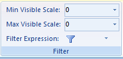
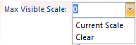
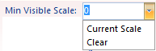

---
id: ScaleRanges
title: Setting the Visible Scale Range
---  

The Layer Properties tab provides commands filtering objects in layers.

  
Figure: The Filter function  
  
### Max Visible Scale

Set the maximum visible scale for the layer. If you zoom in beyond this scale, the layer will not be visible.

  
Figure: Set max visible scale  
  
You can directly type a scale in the Max Visible Scale combo box or click the drop-down arrow and select a scale from the list. Also, you can click Clear in the drop-down list to clear the max visible scale setting.

### Min Visible Scale

Set the minimum visible scale for the layer. If you zoom out beyond this scale, the layer will not be visible.

  
Figure: Set min visible scale  
  
You can directly type a scale in the Min Visible Scale combo box or click the drop-down arrow and select a scale from the list. Also, you can click Clear in the drop-down list to clear the min visible scale setting.