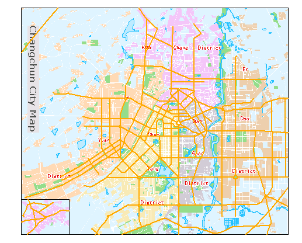
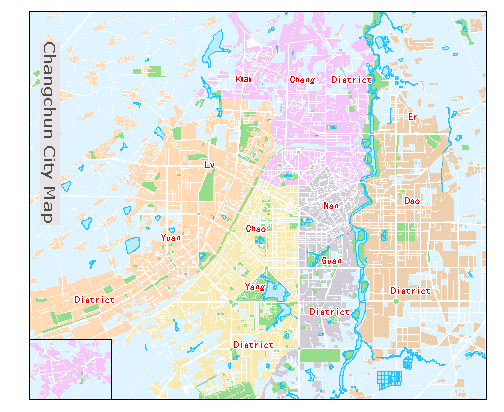

---
id: SettingLayerOrder
title: Changing the Layer Order 
---  

The layer order directly affects the map display effects. There are two primary rules for layer ordering.

  * According to the bounds, the order to place layers is small->medium->large. 
  * According to layer types, the order to place layers is text->point->line->region. 

Note: The rules above is only an suggestion. You can decide how to place the layers according to your needs.

Below shows the effects for before and after placing a layer to the bottom. We can see the importance of the layer order to a map.

 |   
---|---  
Before placing the layer to the bottom | After placing the layer to the bottom  
  
We see that a line layer disappear from the map. Actually, it is not removed, but placed at the bottom.

### Basic Steps

There are two ways to change the layer order.

**Using Layer Control**

  1. If there are open maps in the current workspace. You can open the Layer Control dialog box with the following methods:
    * In the Layer Manager, click the  button.
    * In the Layer Manager, right click on any of the layer and click Layer Control in the context menu that shows up.
  2. In the Layer Control dialog box, select one or multiple layers and change the order of the layers with the buttons provided on the toolbar. About more information about layer order controlling, please refer to [Layer Control](../LayerManagement/LayerControl.htm).

**Dragging Layers**

  1. In the Layer Manager, select one or multiple layers.
  2. Drag the selected layer or layers to the target position.
  3. Release the mouse.

**Layer nodes can be dragged**

In the Layer Manager toolbar, you can set whether the layer nodes can be dragged in the Layer Manager by clicking "Layer nodes can be dragged" in the  drop-down list.

  * If the feature is checked, you are allowed to adjust the order of your layers by dragging layer nodes.
  * If the feature is not checked, the order of layers is fixed, and so you can not change it which can avoid some misoperation.