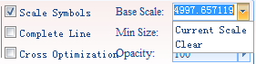

---
id: SymbolZoom
title: Enabling Symbol Scaling
---  

The Layer Properties tab for map window organizes commands for setting layer properties and display parameters.

### Enabling Symbol Scaling

Scale the symbol with map zoom. The command can be applied to the point symbol, line symbol, fill symbol and the border lines of the fill symbol.

Check the Scale Symbol box to scale symbols with map zoom.

### Reference Scale

Define the scale at which symbols will appear at their true size. Symbols will appear larger as you zoom in the map and smaller as you zoom out. Setting a reference scale is like freezing the size of symbols used in your map; the way they look at the reference scale is maintained at all scales. For instance, if you set the reference scale at 1:500000 and the symbol size is 30. The symbol will be scaled up by 5 times to 150 if you zoom the map to 1:500000.

The Reference Scale command is only active if the Scale Symbol box is checked. You can click the Reference Scale drop-down arrow and click Current Scale to set the reference scale to the current scale. Also, you can click Clear to cancel the reference scale setting.

  
Figure: Set the reference scale  
  
### Note

When the base scale is different form the current map scale, do not use "Scale Symbols" may lead to the symbol size change in the current map window, the symbol will be displayed as the size of the current map scale.