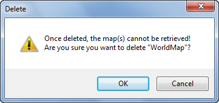

---
id: Map_Del
title: Deleting Maps
---  

### Description

Deletes one or more selected maps.

### Basic Steps

  1. Right click a map node in the Workspace Manager tree, and click Delete.
  2. In the confirmation box that appears, click either OK to confirm you want to delete the selected map or Cancel to go back. A prompt dialog box pops up to confirm if you want to close the datasets. Click Yes to close the datasets. 
  
  
Figure: Delete map confirmation box  

### Note

  1. You can delete several maps at the same time. To do so, you only need to select several map, right click, and then click Delete. 
  2. You can also delete one or more maps by pressing the Delete key on your keyboard. 