### Instructions

Exporting map as a PDF is used widely. Advantages of the method include:  
1\. Maps exported as PDF files can be shared to any users easily  
2\. Maps exported as PDF files can be print in high quality  
3\. Solves the problem of exporting maps in big sizes.

Vector maps and image maps can be exported as PDF, and the result contents are
almost the same as the original maps. The display effects of maps in iDesktop
and PDF are shown below. At the ending of the article, all map effects that
cannot be supported by PDF are listed for reference.

**Map /Layout** | **PDF File**
---|---  
Grid aggregation map |
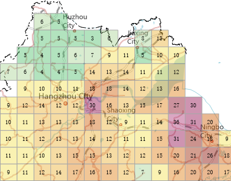 | 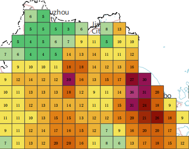  
Heat map|
 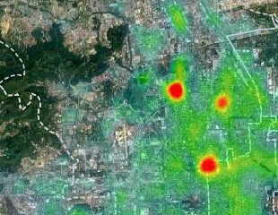 |   
Traffic line map|
 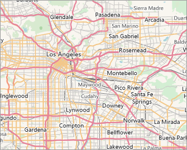|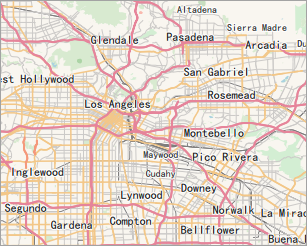  
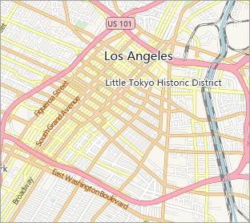|  
Image map|
 |  
Thematic map|
 |  
  
###  Basic steps

  1. Make sure there are no objects selected in the map. Right click your mouse on the map window, and select "Export as PDF" to open the dialog box.
  2. Exporting Settings: Set the path, name, and resolution of the result file.
    
  * **Resolution** : The resolution or DPI of result map. The more the value is, the more clear the map is, and so the processing time and the PDF size increase. 96 is by default. 
  * **Transparent** : Checking the checkbox to make the PDF background transparent.
  3. **Visible Extent** : The scope of output like the whole of map, or only the scope of the map being shown on the current window. The scale of PDF is the same as the scale of current map.
  4. Click "OK" to perform the operation.

###  Output Result

**Layer Tree**

PDF retains the layer tree structure, and the visibility of map can be turned on or off.

Since the drawing order of map is from bottom to top, however the drawing order of PDF is top to bottom, the PDF layer order is opposite as compare to maps.

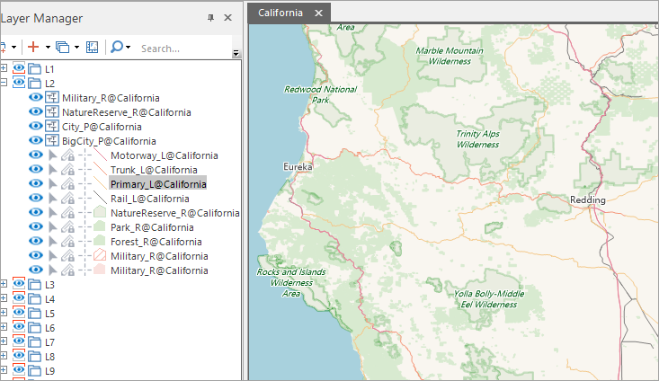  
Figure: Map and map layer tree  

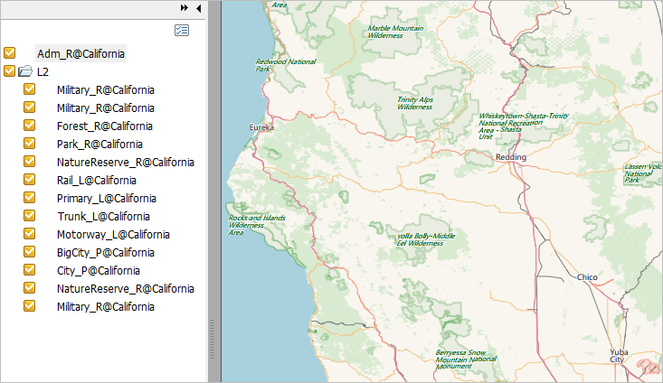  
Figure: PDF  
  
**Layer Visibility**

Each check box can control the corresponding layer visiblity.

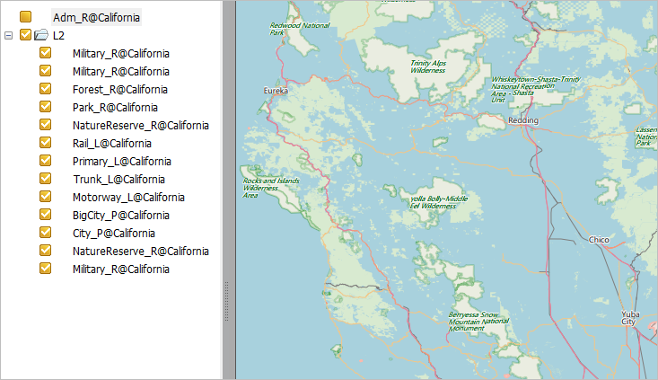  
Figure: Controlling the layer visiblity  
  
**Edit Map**

PDF retains the original vector graphics and text, hence, the edit features in PDF Editor also can be worked on some vector elements and text. But performing massive edit operations is not recommended.

###  The supportive condition to PDF

Almost all map contents can be exported to PDF correctly, and their display effects are the same.

Currently, the following display effects can not be exported to PDF.

Effect|Map/layout|PDF|Replacement  
---|---|---|---  
Layer transparency|Using layer transparency|The transparency of image layer or raster layer wont be lost except for the vector layer.|Produce the same effects by using color transparency.  
Display extent|The extent of image or raster dataset is set through the following way.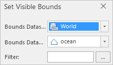|The settings will be lost|Clip dataset through the analysis method to extract the display extent.  
System linesSystem1-4|||Create the line symbols which are not supported by PDF through using the custom lines  
Text effect|Text in bold|If there is the corresponding bold library in the local computer, text can be shown normally.  |The local computer has installed the related bold library. Such as if Arial Bold, the local computer must have the Arial Bold library.  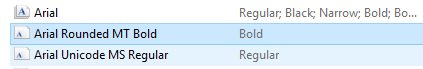  
Multiple languages|Normal |Messy codes |Install related language libraries    
Image fill symbol|Display normally  |The boundaries of region are not matched with the fill boundaries. 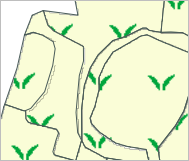 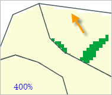 | Suggest to use the pure fill as the fill background, and use vector symbols to create fill symbols.  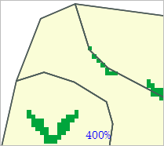  