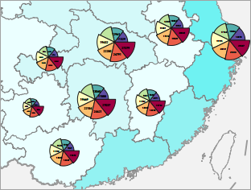
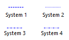

### Instructions

Exporting map as a PDF is used widely. Advantages of the method include:  

  * Maps exported as PDF files can be shared to any users easily.
  * Maps exported as PDF files can be print in high quality.
  * Solves the problem of exporting maps in big sizes.

Vector maps and image maps can be exported as PDF, and the results are almost the same as the original maps. The display effects of maps in SuperMap iDesktop and PDF are shown below. 

**Note**: At the ending of the article, all map effects that cannot be supported by PDF are listed for reference.

<table class=MsoNormalTable border=1 cellspacing=0 cellpadding=0 width=690
 style='width:517.65pt;border-collapse:collapse;border:none'>
 <tr>
  <td width=359 valign=top style='width:269.6pt;border:solid gray 1.0pt;
  padding:0cm 5.4pt 0cm 5.4pt'>
  
<b>Map/Layout</b>

  </td>
  <td width=331 valign=top style='width:248.05pt;border:solid gray 1.0pt;
  border-left:none;padding:0cm 5.4pt 0cm 5.4pt'>
  
<b>PDF</b><b> File</b>

  </td>
 </tr>
 <tr>
  <td width=690 colspan=2 valign=top style='width:517.65pt;border:solid gray 1.0pt;
  border-top:none;padding:0cm 5.4pt 0cm 5.4pt'>
  
Grid aggregation map

  </td>
 </tr>
 <tr>
  <td width=359 valign=top style='width:269.6pt;border:solid gray 1.0pt;
  border-top:none;padding:0cm 5.4pt 0cm 5.4pt'>
  

  </td>
  <td width=331 valign=top style='width:248.05pt;border-top:none;border-left:
  none;border-bottom:solid gray 1.0pt;border-right:solid gray 1.0pt;padding:
  0cm 5.4pt 0cm 5.4pt'>
  

  </td>
 </tr>
  <tr>
  <td width=690 colspan=2 valign=top style='width:517.65pt;border:solid gray 1.0pt;
  border-top:none;padding:0cm 5.4pt 0cm 5.4pt'>
  
Heat map

  </td>
 </tr>
 <tr>
  <td width=359 valign=top style='width:269.6pt;border:solid gray 1.0pt;
  border-top:none;padding:0cm 5.4pt 0cm 5.4pt'>
  

  </td>
  <td width=331 valign=top style='width:248.05pt;border-top:none;border-left:
  none;border-bottom:solid gray 1.0pt;border-right:solid gray 1.0pt;padding:
  0cm 5.4pt 0cm 5.4pt'>
  

  </td>
 </tr>
 <tr>
  <td width=690 colspan=2 valign=top style='width:517.65pt;border:solid gray 1.0pt;
  border-top:none;padding:0cm 5.4pt 0cm 5.4pt'>
  
Traffic line map

  </td>
 </tr>
 <tr>
  <td width=359 valign=top style='width:269.6pt;border:solid gray 1.0pt;
  border-top:none;padding:0cm 5.4pt 0cm 5.4pt'>
  

  </td>
  <td width=331 valign=top style='width:248.05pt;border-top:none;border-left:
  none;border-bottom:solid gray 1.0pt;border-right:solid gray 1.0pt;padding:
  0cm 5.4pt 0cm 5.4pt'>
  

  </td>
 </tr>
 <tr>
  <td width=359 valign=top style='width:269.6pt;border:solid gray 1.0pt;
  border-top:none;padding:0cm 5.4pt 0cm 5.4pt'>
  

  </td>
  <td width=331 valign=top style='width:248.05pt;border-top:none;border-left:
  none;border-bottom:solid gray 1.0pt;border-right:solid gray 1.0pt;padding:
  0cm 5.4pt 0cm 5.4pt'>
  

  </td>
 </tr>
 <tr>
  <td width=690 colspan=2 valign=top style='width:517.65pt;border:solid gray 1.0pt;
  border-top:none;padding:0cm 5.4pt 0cm 5.4pt'>
  
POI

  </td>
 </tr>
 <tr>
  <td width=359 valign=top style='width:269.6pt;border:solid gray 1.0pt;
  border-top:none;padding:0cm 5.4pt 0cm 5.4pt'>
  

  </td>
  <td width=331 valign=top style='width:248.05pt;border-top:none;border-left:
  none;border-bottom:solid gray 1.0pt;border-right:solid gray 1.0pt;padding:
  0cm 5.4pt 0cm 5.4pt'>
  

  

  </td>
 </tr>
 <!--tr>
  <td width=359 valign=top style='width:269.6pt;border:solid gray 1.0pt;
  border-top:none;padding:0cm 5.4pt 0cm 5.4pt'>
  

  </td>
  <td width=331 valign=top style='width:248.05pt;border-top:none;border-left:
  none;border-bottom:solid gray 1.0pt;border-right:solid gray 1.0pt;padding:
  0cm 5.4pt 0cm 5.4pt'>
  

  </td>
 </tr-->
 <tr>
  <td width=690 colspan=2 valign=top style='width:517.65pt;border:solid gray 1.0pt;
  border-top:none;padding:0cm 5.4pt 0cm 5.4pt'>
  
Image map

  </td>
 </tr>
 <tr>
  <td width=359 valign=top style='width:269.6pt;border:solid gray 1.0pt;
  border-top:none;padding:0cm 5.4pt 0cm 5.4pt'>
  
.

  </td>
  <td width=331 valign=top style='width:248.05pt;border-top:none;border-left:
  none;border-bottom:solid gray 1.0pt;border-right:solid gray 1.0pt;padding:
  0cm 5.4pt 0cm 5.4pt'>
  

  </td>
 </tr>
 <tr>
  <td width=690 colspan=2 valign=top style='width:517.65pt;border:solid gray 1.0pt;
  border-top:none;padding:0cm 5.4pt 0cm 5.4pt'>
  
Thematic map

  </td>
 </tr>
 <tr>
  <td width=359 valign=top style='width:269.6pt;border:solid gray 1.0pt;
  border-top:none;padding:0cm 5.4pt 0cm 5.4pt'>
  
.

  </td>
  <td width=331 valign=top style='width:248.05pt;border-top:none;border-left:
  none;border-bottom:solid gray 1.0pt;border-right:solid gray 1.0pt;padding:
  0cm 5.4pt 0cm 5.4pt'>
  

  </td>
 </tr>
</table>

  
### Function Entrance

Before using the feature, please make sure that there are no objects selected from the map.

  * Right click on the map window and select **Export as PDF** to open the dialog box.

### Parameter Description

  * **Resolution** : The resolution or DPI of result map. The more the value is, the more clear the map is, and so the processing time and the PDF size increase. 96 is by default. 
  * **Transparent** : Checking the checkbox to make the PDF background transparent.
  * **Visible Extent** : The scope of output like the whole of map, or only the scope of the map being shown on the current window. The scale of PDF is the same as the scale of current map.
  * Click **OK** to perform the operation.

###  Output Result

  * **Layer Tree**

PDF retains the layer tree structure, and the visibility of map can be turned on or off.

Since the drawing order of map is from bottom to top, however the drawing order of PDF is top to bottom, the PDF layer order is opposite as compare to maps.

  

  

  * **Layer Visiblity**

Each check box can control the corresponding layer visiblity.

  

  * **Edit Map**

PDF retains the original vector graphics and text, hence, the edit features in PDF Editor also can be worked on some vector elements and text. But performing massive edit operations is not recommended.

###  The supportive condition to PDF

Almost all map contents can be exported to PDF correctly, and their display effects are the same.

Currently, several display effects can not be exported to PDF, following contents detail which effects.

<table class=MsoNormalTable border=1 cellspacing=0 cellpadding=0
 style='border-collapse:collapse;border:none'>
 <tr>
  <td width=140 style='width:110.8pt;border:solid black 1.0pt;padding:0cm 5.4pt 0cm 5.4pt'>
  
&nbsp;

  </td>
  <td width=180 style='width:180.2pt;border:solid black 1.0pt;border-left:none;
  padding:0cm 5.4pt 0cm 5.4pt'>
  
Map/layout

  </td>
  <td width=180 style='width:180.8pt;border:solid black 1.0pt;border-left:none;
  padding:0cm 5.4pt 0cm 5.4pt'>
  
PDF

  </td>
  <td width=110 style='width:180.0pt;border:solid black 1.0pt;border-left:none;
  padding:0cm 5.4pt 0cm 5.4pt'>
  
Replacement

  </td>
 </tr>
  <tr>
  <td width=140 style='width:110.8pt;border:solid black 1.0pt;border-top:none;
  padding:0cm 5.4pt 0cm 5.4pt'>
  
Specially shaped objects (Rounded rectangle, circle, ellipse, polygon)

  </td>
  <td width=180 style='width:180.2pt;border-top:none;border-left:none;
  border-bottom:solid black 1.0pt;border-right:solid black 1.0pt;padding:0cm 5.4pt 0cm 5.4pt'>
  

  </td>
  <td width=180 style='width:180.8pt;border-top:none;border-left:none;
  border-bottom:solid black 1.0pt;border-right:solid black 1.0pt;padding:0cm 5.4pt 0cm 5.4pt'>
  

  </td>
  <td width=110 style='width:180.0pt;border-top:none;border-left:none;border-bottom:
  solid black 1.0pt;border-right:solid black 1.0pt;padding:0cm 5.4pt 0cm 5.4pt'>
  
None

  </td>
 </tr>
 <tr>
  <td width=140 style='width:110.8pt;border:solid black 1.0pt;border-top:none;
  padding:0cm 5.4pt 0cm 5.4pt'>
  
Layer transparency

  </td>
  <td width=180 style='width:180.2pt;border-top:none;border-left:none;
  border-bottom:solid black 1.0pt;border-right:solid black 1.0pt;padding:0cm 5.4pt 0cm 5.4pt'>
  
Using layer transparency

  </td>
  <td width=180 style='width:180.8pt;border-top:none;border-left:none;
  border-bottom:solid black 1.0pt;border-right:solid black 1.0pt;padding:0cm 5.4pt 0cm 5.4pt'>
  
The transparency of image layer or raster layer wont be lost except for the vector layer.

  </td>
  <td width=110 style='width:180.0pt;border-top:none;border-left:none;border-bottom:
  solid black 1.0pt;border-right:solid black 1.0pt;padding:0cm 5.4pt 0cm 5.4pt'>
  
Produce the same effects by using color transparency.

  </td>
 </tr>
  <tr>
  <td width=140 style='width:110.8pt;border:solid black 1.0pt;border-top:none;
  padding:0cm 5.4pt 0cm 5.4pt'>
  
Display extent

  </td>
  <td width=180 style='width:180.2pt;border-top:none;border-left:none;
  border-bottom:solid black 1.0pt;border-right:solid black 1.0pt;padding:0cm 5.4pt 0cm 5.4pt'>
  
The extent of image or raster dataset is set through the following way.

  </td>
  <td width=180 style='width:180.8pt;border-top:none;border-left:none;
  border-bottom:solid black 1.0pt;border-right:solid black 1.0pt;padding:0cm 5.4pt 0cm 5.4pt'>
  
The settings will be lost

  </td>
  <td width=110 style='width:180.0pt;border-top:none;border-left:none;border-bottom:
  solid black 1.0pt;border-right:solid black 1.0pt;padding:0cm 5.4pt 0cm 5.4pt'>
  
Clip dataset through the analysis method to extract the display extent.

  </td>
 </tr>
 <tr>
  <td width=140 style='width:110.8pt;border:solid black 1.0pt;border-top:none;
  padding:0cm 5.4pt 0cm 5.4pt'>
  
System linesSystem1-4

  
&nbsp;

  </td>
  <td width=180 style='width:180.2pt;border-top:none;border-left:none;
  border-bottom:solid black 1.0pt;border-right:solid black 1.0pt;padding:0cm 5.4pt 0cm 5.4pt'>
  

  </td>
  <td width=180 style='width:180.8pt;border-top:none;border-left:none;
  border-bottom:solid black 1.0pt;border-right:solid black 1.0pt;padding:0cm 5.4pt 0cm 5.4pt'>
  

  </td>
  <td width=110 style='width:180.0pt;border-top:none;border-left:none;border-bottom:
  solid black 1.0pt;border-right:solid black 1.0pt;padding:0cm 5.4pt 0cm 5.4pt'>
  
Create the line symbols which are not supported by PDF through using the custom lines

  </td>
 </tr>
  <tr>
  <td width=140 style='width:110.8pt;border:solid black 1.0pt;border-top:none;
  padding:0cm 5.4pt 0cm 5.4pt'>
  
Text effect

  </td>
  <td width=180 style='width:180.2pt;border-top:none;border-left:none;
  border-bottom:solid black 1.0pt;border-right:solid black 1.0pt;padding:0cm 5.4pt 0cm 5.4pt'>
  
Text in bold

  </td>
  <td width=180 style='width:180.8pt;border-top:none;border-left:none;
  border-bottom:solid black 1.0pt;border-right:solid black 1.0pt;padding:0cm 5.4pt 0cm 5.4pt'>
  
If there is the corresponding bold library in the local computer, text can be shown normally.
  </td>
  <td width=110 style='width:180.0pt;border-top:none;border-left:none;border-bottom:
  solid black 1.0pt;border-right:solid black 1.0pt;padding:0cm 5.4pt 0cm 5.4pt'>
  
The local computer has installed the related bold library. Such as if Arial Bold, the local computer must have the Arial Bold library.  

  </td>
 </tr>
  <tr>
  <td width=140 style='width:110.8pt;border:solid black 1.0pt;border-top:none;
  padding:0cm 5.4pt 0cm 5.4pt'>
  
Multiple languages

  </td>
  <td width=180 style='width:180.2pt;border-top:none;border-left:none;
  border-bottom:solid black 1.0pt;border-right:solid black 1.0pt;padding:0cm 5.4pt 0cm 5.4pt'>
  
Normal 

  </td>
  <td width=180 style='width:180.8pt;border-top:none;border-left:none;
  border-bottom:solid black 1.0pt;border-right:solid black 1.0pt;padding:0cm 5.4pt 0cm 5.4pt'>
  
Messy codes 

  </td>
  <td width=110 style='width:180.0pt;border-top:none;border-left:none;border-bottom:
  solid black 1.0pt;border-right:solid black 1.0pt;padding:0cm 5.4pt 0cm 5.4pt'>
  
Install related language libraries 

  </td>
 </tr>
 
 
 <tr>
  <td width=140 style='width:110.8pt;border:solid black 1.0pt;border-top:none;
  padding:0cm 5.4pt 0cm 5.4pt'>
  
Image fill symbol

  </td>
  <td width=180 style='width:180.2pt;border-top:none;border-left:none;
  border-bottom:solid black 1.0pt;border-right:solid black 1.0pt;padding:0cm 5.4pt 0cm 5.4pt'>
  
Display normally 

  </td>
  <td width=180 style='width:180.8pt;border-top:none;border-left:none;
  border-bottom:solid black 1.0pt;border-right:solid black 1.0pt;padding:0cm 5.4pt 0cm 5.4pt'>
  
The boundaries of region are not matched with the fill boundaries.  

  </td>
  <td width=110 style='width:180.0pt;border-top:none;border-left:none;border-bottom:
  solid black 1.0pt;border-right:solid black 1.0pt;padding:0cm 5.4pt 0cm 5.4pt'>
  
Suggest to use the pure fill as the fill background, and use vector symbols to create fill symbols. 

  </td>
 </tr>
 
</table>

