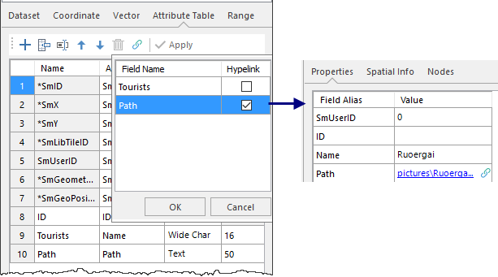
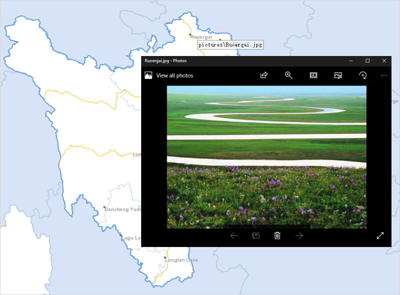

### Function description

Turns text fields or wide character fields into hyperlinks. You can follow reference data by clicking objects. Reference data can be:

  * **Files** : images, Excel, Word, and videos.
  * **URL** : websites. Your web browser will automatically open and display corresponding websites.

###  **Application scenarios** :

  * Viewing images of surface features like buildings, lakes, scenic spots, and so on.
  * Checking detail information of elements on a map like company introduction.

### Operation instructions

  1. In the context menu of your dataset, select Properties. In the Attribute Table tab of the Properties panel, click the icon  **Hyperlink** in the toolbar. In the popup window, check the field as required and click OK. Finally, click Apply in the toolbar to enable the Hyperlink feature. 
  2. **Edit hyperlink field** : if you want to link to a website, you can enter an URL directly. If you want to link to a file, you can enter its absolute path or relative path (relative to the path of your udb). For example, if your picture locates in the img folder which located in the same level of the UDB's parent directory, the relative path should be **..\img\pic.png**.
  

  3. **Enable/disable map Hyperlink** : Open your dataset which has one or more hyperlink fields. Click the Map tab > Browse group > Hyperlink button. And then you can view the files or websites you have linked to. Click the Hyperlink again to disable the feature.
  4. Move your mouse in the map window, all links will be shown when hovering your mouse over an vector object, you can click any link to view related content.
  

### Notes

  * Only fields in the type of text or wide chart can be set to hyperlink fields.
  * In the Attribute Table tab of the Properties panel, click the Hyperlink icon and then uncheck the corresponding field to convert it to a normal field. And then click the Apply button.

