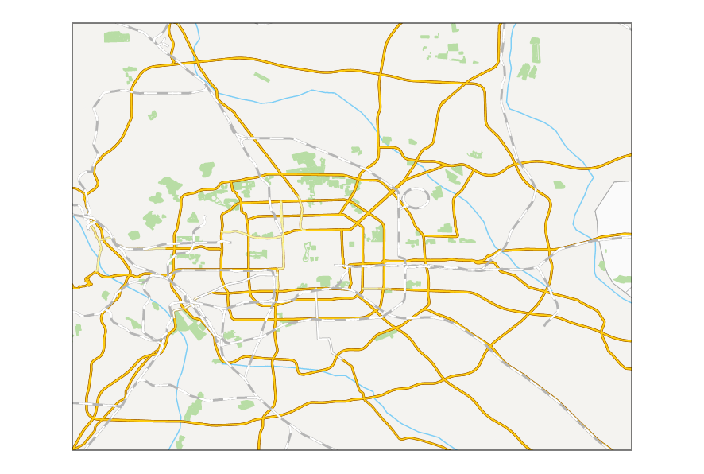

### Introduction

Map blink is designed for the map swipe layer, hiding the swipe layer at specified intervals, and then display again. Map blink can be used for comparison of historical data and current data.

The setting for map blink function is shown as below. The button Blink is used to turn on or off the blink status of the layer. When the button is on, the blink operation is activated. When the button is off, the blink operation is deactivated. Besides, the blink and swipe functions are exclusive with each other.

### Basic Steps

  1. Open the target map. 
  2. Click "Swipe" on Map Swipe group in Map tab to open Map Swipe dialog box. Choose a blink layer from Select Layer list. You can choose any layer or layer group but a layer in a layer group.
  3. Set the interval for layer blink, with the unit being milliseconds.
  4. Click the Blink button, the blink layer will hide and display according to the specified time intervals, as shown below:
  
  